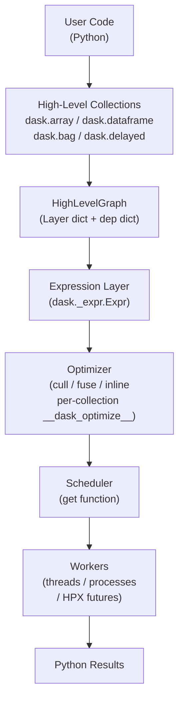
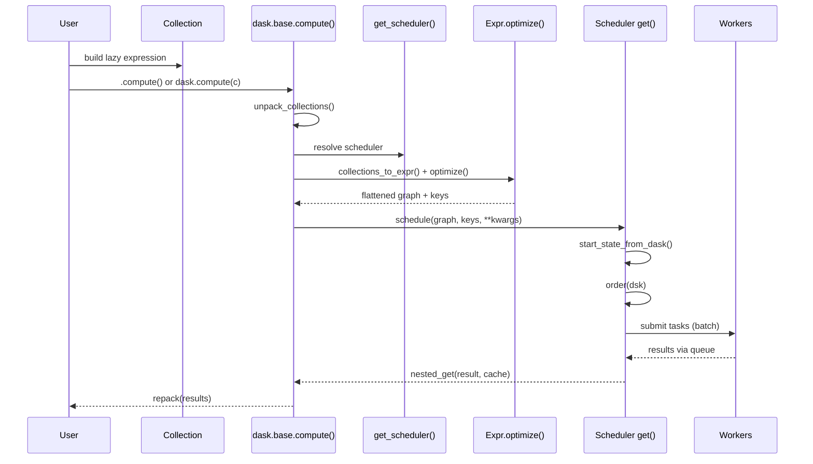

# Dask Codebase Knowledge Document

**Repository path:** `vendor/dask/` (git submodule in HPyX)
**Analysis date:** 2026-04-24
**Analyst model:** Claude Sonnet 4.6
**Purpose:** Master reference for future LLM agents implementing features, fixing bugs, refactoring, and — critically — building an HPX-backed scheduler plug-in for HPyX.

---

## Table of Contents

1. [Executive Summary](#1-executive-summary)
2. [System Architecture](#2-system-architecture)
3. [Feature-by-Feature Analysis](#3-feature-by-feature-analysis)
   - 3.1 [Task Graph Fundamentals (`_task_spec`, `core`)](#31-task-graph-fundamentals-_task_spec-core)
   - 3.2 [Base Collection Protocol (`base`, `typing`)](#32-base-collection-protocol-base-typing)
   - 3.3 [HighLevelGraph and Layer System](#33-highlevelgraph-and-layer-system)
   - 3.4 [Local / Synchronous Scheduler (`local`)](#34-local--synchronous-scheduler-local)
   - 3.5 [Threaded Scheduler (`threaded`)](#35-threaded-scheduler-threaded)
   - 3.6 [Multiprocessing Scheduler (`multiprocessing`)](#36-multiprocessing-scheduler-multiprocessing)
   - 3.7 [Distributed Scheduler Bridge (`distributed`)](#37-distributed-scheduler-bridge-distributed)
   - 3.8 [Optimization Passes (`optimization`)](#38-optimization-passes-optimization)
   - 3.9 [Task Ordering (`order`)](#39-task-ordering-order)
   - 3.10 [Blockwise Layer (`blockwise`)](#310-blockwise-layer-blockwise)
   - 3.11 [Delayed Collection (`delayed`)](#311-delayed-collection-delayed)
   - 3.12 [Array Collection (`array`)](#312-array-collection-array)
   - 3.13 [Bag Collection (`bag`)](#313-bag-collection-bag)
   - 3.14 [DataFrame Collection (`dataframe`)](#314-dataframe-collection-dataframe)
   - 3.15 [Tokenization / Hashing (`tokenize`, `hashing`)](#315-tokenization--hashing-tokenize-hashing)
   - 3.16 [Callbacks / Diagnostics (`callbacks`)](#316-callbacks--diagnostics-callbacks)
   - 3.17 [Configuration System (`config`)](#317-configuration-system-config)
   - 3.18 [Expression Layer (`_expr`)](#318-expression-layer-_expr)
   - 3.19 [Graph Manipulation Utilities (`graph_manipulation`)](#319-graph-manipulation-utilities-graph_manipulation)
   - 3.20 [Memory Estimation (`sizeof`)](#320-memory-estimation-sizeof)
4. [Nuances, Subtleties, and Gotchas](#4-nuances-subtleties-and-gotchas)
5. [Technical Reference and Glossary](#5-technical-reference-and-glossary)
6. [Integration Notes for HPyX](#6-integration-notes-for-hpyx)
7. [Assumptions Table](#7-assumptions-table)

---

## 1. Executive Summary

Dask is a Python library for parallel and distributed computing built around **lazy, graph-based evaluation**. Users construct operations on high-level collections (Array, DataFrame, Bag, Delayed), which are internally represented as directed acyclic graphs (DAGs) of tasks. Evaluation is deferred until `.compute()` is called, at which point an optimization pass runs (culling, fusion, inlining), and the resulting flat task graph is handed to a configurable scheduler.

**Key design axis for HPyX:** The entire execution pathway from user code to results passes through a single, well-defined interface — the **scheduler `get` function** — with signature `(dsk: Mapping, keys: Sequence[Key] | Key, **kwargs) -> Any`. An HPX-backed scheduler is a drop-in implementation of this interface.

**Size and scope:** Dask is large (40+ modules in the core package, plus `array/`, `bag/`, `dataframe/`, `diagnostics/`, `bytes/`). This document covers the critical paths for a scheduler integrator. High-level collection internals (array chunk arithmetic, dataframe pandas compat, etc.) are not covered in detail.

---

## 2. System Architecture

### 2.1 Major Components



### 2.2 Data Flow: User Code to Result



### 2.3 Scheduler Resolution Chain

The function `get_scheduler()` (`vendor/dask/dask/base.py:1106`) walks this priority chain:

1. Explicit `scheduler=` kwarg (string name, callable, `Executor`, or `Client`)
2. Global config key `"scheduler"`
3. Active `distributed.Client` if `distributed` is installed
4. Collection's `__dask_scheduler__` class attribute
5. Returns `None` (raises later)

Named scheduler strings are mapped in `named_schedulers` dict (`vendor/dask/dask/base.py:1040`):

| String | Function |
|---|---|
| `"sync"` / `"synchronous"` / `"single-threaded"` | `dask.local.get_sync` |
| `"threads"` / `"threading"` | `dask.threaded.get` |
| `"processes"` / `"multiprocessing"` | `dask.multiprocessing.get` |
| `"distributed"` / `"dask.distributed"` | `distributed.Client.get` |

A `concurrent.futures.Executor` instance is also accepted; dask wraps it via `partial(local.get_async, executor.submit, num_workers)`.

### 2.4 Third-Party Integrations

| Library | Role | Optionality |
|---|---|---|
| `numpy` | Array chunks | Required for `dask.array` |
| `pandas` | DataFrame partitions | Required for `dask.dataframe` |
| `cloudpickle` | Serialization in multiprocessing | Required for `dask.multiprocessing` |
| `toolz` / `tlz` | Functional utilities (merge, curry, etc.) | Required everywhere |
| `distributed` | Distributed scheduler | Optional, lazy import |
| `graphviz` / `ipycytoscape` | Visualization | Optional |
| `fsspec` | File system abstraction (bag IO) | Required for bag IO |
| `tblib` | Traceback serialization | Optional (multiprocessing) |
| `yaml` | Configuration file parsing | Required |

---

## 3. Feature-by-Feature Analysis

### 3.1 Task Graph Fundamentals (`_task_spec`, `core`)

**Files:**
- `vendor/dask/dask/_task_spec.py` — new task object model (primary)
- `vendor/dask/dask/core.py` — legacy task tuple utilities + graph traversal

#### 3.1.1 The New Task Object Model (`_task_spec.py`)

The file `_task_spec.py` introduced a class-based task representation that replaced the old `(callable, *args)` tuple convention. The legacy format is still accepted everywhere via `convert_legacy_graph()`.

**Class hierarchy:**

```
GraphNode  (abstract base, vendor/dask/dask/_task_spec.py:378)
  ├── Alias       — pointer to another key (target=key by default)
  ├── DataNode    — literal value, no dependencies, callable returns self.value
  ├── Task        — function call: func(*args, **kwargs) with TaskRef dependencies
  ├── List        — collection of GraphNode/values → list
  ├── Tuple       — collection → tuple
  ├── Set         — collection → set
  └── Dict        — dict of GraphNode/values → dict
```

**`GraphNode` protocol (`vendor/dask/dask/_task_spec.py:378`):**
- `key`: unique identifier (a `Key` = str | int | float | tuple thereof)
- `dependencies: frozenset` — keys this node requires before it can run
- `__call__(values: dict) -> Any` — execute with resolved dependency dict
- `substitute(subs, key=None) -> GraphNode` — rewrite keys (for optimization/cloning)
- `fuse(*tasks) -> GraphNode` (static) — merge a subgraph into one opaque `Task` using `_execute_subgraph`

**`Task` (`vendor/dask/dask/_task_spec.py:636`):**
- Stores `func`, `args`, `kwargs`
- Dependencies are those args/kwargs that are `TaskRef` or nested `GraphNode`
- `__call__(values)` resolves `TaskRef` from `values` dict and calls `func(*resolved_args, **resolved_kwargs)`
- Uses `_execute_subgraph` internally when fused

**`DataNode` (`vendor/dask/dask/_task_spec.py:575`):**
- Wraps literal values — no dependencies, `__call__` returns `self.value`
- `data_producer` property returns `True` (used by schedulers to distinguish data from compute nodes)

**`TaskRef` (`vendor/dask/dask/_task_spec.py:333`):**
- A lightweight pointer to another key (not a `GraphNode`)
- Used inside `Task.args` to express dependencies

**Legacy compatibility:**
- `convert_legacy_graph(dsk, all_keys=None)` (`vendor/dask/dask/_task_spec.py:259`) converts a dict of `{key: (func, *args)}` tuples into `{key: GraphNode}` dicts
- `convert_legacy_task(key, task, all_keys)` handles individual task values
- Called at the start of every scheduler `get` invocation

**`fuse_linear_task_spec(dsk, keys)` (`vendor/dask/dask/_task_spec.py:1105`):**
The `GraphNode`-native equivalent of `optimization.fuse_linear`. Verified implementation:
- Takes a `{key: GraphNode}` dict and a set of output keys.
- Builds `DependenciesMapping` and `reverse_dict` to identify linear chains.
- Walks chains in both directions (toward leaves and toward roots) as long as each node has exactly one dependency and one dependent.
- Nodes with `block_fusion=True` (a per-`GraphNode` attribute) are excluded from fusion chains (they act as fusion barriers).
- Output keys are never fused into a chain (they must remain individually addressable).
- Fuses identified chains into a single compound `Task` using `GraphNode.fuse()`.
- Used by the `delayed` optimization path (imported in `delayed.py`).

**Key utilities in `core.py`:**
- `istask(x)` (`vendor/dask/dask/core.py:40`) — returns `True` if x is a `GraphNode` (non-DataNode) or legacy `(callable, *args)` tuple
- `get_dependencies(dsk, key)` (`vendor/dask/dask/core.py:213`) — returns set of keys a given key depends on
- `get_deps(dsk)` (`vendor/dask/dask/core.py:259`) — returns `(dependencies, dependents)` dicts for entire graph
- `flatten(seq)` (`vendor/dask/dask/core.py:275`) — recursively flatten nested lists (not tuples)
- `toposort(dsk)` (`vendor/dask/dask/core.py:455`) — Tarjan DFS topological sort with cycle detection
- `quote(x)` (`vendor/dask/dask/core.py:522`) — wrap a value in `(literal(x),)` to prevent task interpretation
- `subs(task, key, val)` (`vendor/dask/dask/core.py:323`) — substitute a key inside a legacy task tuple

**`execute_graph(dsk, cache, keys)` (`vendor/dask/dask/_task_spec.py:1064`):**
The primary execution entry-point for the synchronous path. Signature verified:
```python
def execute_graph(
    dsk: Iterable[GraphNode] | Mapping[KeyType, GraphNode],
    cache: MutableMapping[KeyType, object] | None = None,
    keys: Container[KeyType] | None = None,
) -> MutableMapping[KeyType, object]:
```
Algorithm (lines 1080–1102):
1. Accepts a list/tuple/set/frozenset of `GraphNode` objects or a dict `{key: GraphNode}`. Lists are converted to dicts via `{t.key: t for t in dsk}`.
2. Builds a `refcount` dict from `DependenciesMapping(dsk)` to track how many consumers each key still has.
3. Calls `dask.order.order(dsk)` and iterates keys in priority order (`sorted(..., key=priorities[key])`).
4. For each key: `cache[key] = node(cache)`, then decrements `refcount` for each dependency; if a dep's refcount hits zero and it is not in the requested `keys` set, it is evicted from `cache` immediately (memory-efficient streaming).
5. Returns `cache`.

This function coexists with the `get_async`-based path. It is used by the synchronous `get_sync` alias and internally (e.g., `execute_graph` is called at line 199 of `_task_spec.py` for sub-graph fusion via `_execute_subgraph`). The queue-based `get_async` loop remains the path for all parallel schedulers. The two paths are complementary, not mutually exclusive.

**Findings:**
- The `_task_spec.py` GraphNode model is the internal representation as of the version under analysis. Legacy tuple tasks are converted on entry to every scheduler.
- `GraphNode.__eq__` uses tokenization — two structurally identical tasks are equal. This is load-bearing for deduplication.
- `execute_graph` is a strict topological-order executor using `order()` for priority. It does NOT replace `core.get` for parallel paths; both paths coexist and are used for different scheduler modes.
- The early-eviction logic in `execute_graph` (refcount-based `del cache[dep]`) is critical for memory-bounded streaming on large graphs.

---

### 3.2 Base Collection Protocol (`base`, `typing`)

**Files:**
- `vendor/dask/dask/base.py` — `DaskMethodsMixin`, `compute`, `persist`, `get_scheduler`, `unpack_collections`
- `vendor/dask/dask/typing.py` — `DaskCollection`, `HLGDaskCollection`, `SchedulerGetCallable` protocols

#### 3.2.1 The `DaskCollection` Protocol (`vendor/dask/dask/typing.py:103`)

Any Python class that satisfies this `typing.Protocol` is a Dask collection. Required dunder methods:

| Method | Signature | Purpose |
|---|---|---|
| `__dask_graph__()` | `() -> Mapping` | Return the task graph (HLG or plain dict) |
| `__dask_keys__()` | `() -> NestedKeys` | Return output keys (possibly nested lists) |
| `__dask_postcompute__()` | `() -> (callable, tuple)` | Finalizer after all keys are computed |
| `__dask_postpersist__()` | `() -> (callable, tuple)` | Rebuilder for `persist()` |
| `__dask_tokenize__()` | `() -> Hashable` | Stable hash identity |
| `__dask_optimize__` | staticmethod/classmethod | Graph optimization pass |
| `__dask_scheduler__` | staticmethod | Default scheduler callable |

Additionally, `HLGDaskCollection` (`vendor/dask/dask/typing.py:404`) adds `__dask_layers__() -> Sequence[str]`, required when the graph is a `HighLevelGraph`.

#### 3.2.2 `DaskMethodsMixin` (`vendor/dask/dask/base.py:254`)

Provides `.compute()`, `.persist()`, `.visualize()` using the protocol above. Collections that inherit this mixin need only implement the dunder methods.

#### 3.2.3 `compute()` (`vendor/dask/dask/base.py:601`)

Top-level function, also available as collection method. Steps:

1. `unpack_collections(*args)` — finds all dask objects, deduplicates by token
2. `get_scheduler(...)` — resolves the scheduler callable
3. `collections_to_expr(collections, optimize_graph)` — wraps collections in `Expr` IR
4. `FinalizeCompute(expr)` — adds postcompute wrapper
5. `expr.optimize()` — runs optimization passes
6. `schedule(expr, keys, **kwargs)` — dispatches to the scheduler

Note: `compute()` passes the `Expr` object directly to the scheduler as `dsk`. Schedulers that accept only flat dicts must call `dsk.__dask_graph__()` to materialize. The built-in schedulers (`threaded.get`, `local.get_sync`) do this via `convert_legacy_graph(dsk)` which calls `dsk.__dask_graph__()` internally.

#### 3.2.4 `get_scheduler()` (`vendor/dask/dask/base.py:1106`)

See Section 2.3. Key behavior: a `concurrent.futures.Executor` instance is accepted and automatically wrapped. This is the **primary extension point for HPyX**.

**SchedulerGetCallable protocol (`vendor/dask/dask/typing.py:34`):**
```python
def __call__(self, dsk: Graph, keys: Sequence[Key] | Key, **kwargs: Any) -> Any: ...
```
`Graph` is `Mapping[Key, Any]`. In practice `dsk` may be an `Expr` object (implements `Mapping`) or a plain dict.

**Findings:**
- `DaskMethodsMixin.__await__` (`vendor/dask/dask/base.py:380`) requires `distributed` — async/await on collections is not supported with local schedulers.
- `optimize()` (`vendor/dask/dask/base.py:539`) is a separate top-level function that materializes the graph and loses HLG layer annotations.

**Open Questions:**
- In the current codebase, `compute()` passes an `Expr` to the scheduler, not a flat dict. Does the `Expr.__dask_graph__()` call on the scheduler side always work? How does the threaded scheduler handle it?

---

### 3.3 HighLevelGraph and Layer System

**Files:**
- `vendor/dask/dask/highlevelgraph.py` — `Layer` ABC, `MaterializedLayer`, `HighLevelGraph`
- `vendor/dask/dask/layers.py` — specialized layer types (ArrayBlockIdDep, etc.)
- `vendor/dask/dask/blockwise.py` — `Blockwise` layer (symbolic, lazy)

#### 3.3.1 `Layer` ABC (`vendor/dask/dask/highlevelgraph.py:51`)

A `Layer` is a `Mapping[Key, Any]` (task graph fragment) with additional metadata and lifecycle hooks. Key abstract methods:

- `is_materialized() -> bool` — has the layer been fully enumerated?
- `get_output_keys() -> Set[Key]` — output keys without materializing
- `cull(keys, all_hlg_keys) -> (Layer, deps_map)` — remove unused tasks
- `clone(keys, seed, bind_to) -> (Layer, bool)` — create renamed copies (for `graph_manipulation`)
- `get_dependencies(key, all_hlg_keys) -> set` — per-key dependency lookup

Layers also carry:
- `annotations: Mapping[str, Any] | None` — scheduler hints (`priority`, `workers`, `retries`, `resources`)
- `collection_annotations: Mapping[str, Any] | None` — visualization metadata

`has_legacy_tasks` (`vendor/dask/dask/highlevelgraph.py:97`) is a cached property that checks if any values are not `GraphNode` instances.

#### 3.3.2 `MaterializedLayer` (`vendor/dask/dask/highlevelgraph.py:328`)

The default concrete layer — wraps any `Mapping`. Most intermediate computation layers become `MaterializedLayer` instances.

#### 3.3.3 `HighLevelGraph` (`vendor/dask/dask/highlevelgraph.py:360+`)

A `Mapping[Key, Any]` composed of named `Layer` objects with explicit inter-layer dependencies.

```python
HighLevelGraph(
    layers: Mapping[str, Graph],      # {layer_name: layer_mapping}
    dependencies: Mapping[str, set[str]],  # {layer_name: {dep_layer_names}}
    key_dependencies: dict[Key, set] | None = None,
)
```

Layers that are not `Layer` instances are automatically wrapped in `MaterializedLayer` at construction time.

**`from_collections(name, layer, dependencies)` (`vendor/dask/dask/highlevelgraph.py:470`):**
The primary factory for building new HLGs in collection operations. Merges input collection graphs and adds the new layer.

**Key O(1) optimization (`vendor/dask/dask/highlevelgraph.py:531`):**
`__getitem__` first tries `layers[key][key]` (for scalar/Delayed) then `layers[key[0]][key]` (for array/bag/dataframe) before falling back to O(n) scan.

**Culling at HLG level:**
Each `Layer.cull()` is called during graph optimization. HLG-level culling (`vendor/dask/dask/highlevelgraph.py`, method `cull`) removes entire layers that are unreachable from the output keys.

**Findings:**
- HLG is the representation used by all built-in collections except `Delayed` with plain-dict graph.
- The transition from HLG → flat dict happens when `ensure_dict(hlg)` is called, or when `to_dict()` is called, which merges all layers.
- Layer annotations survive optimization only if the layer is not rematerialized. Calling `dask.optimize()` will lose annotations (noted in the source comment, `vendor/dask/dask/base.py:546`).

**Open Questions:**
- The `Blockwise` layer (`vendor/dask/dask/blockwise.py`) is symbolic and generates tasks on demand. It overrides `cull`, `get_output_keys`, and potentially avoids full materialization. How does this interact with HPX's need for a full task list at submission time?

---

### 3.4 Local / Synchronous Scheduler (`local`)

**File:** `vendor/dask/dask/local.py`

This module is the heart of all built-in shared-memory schedulers. It exposes:

#### 3.4.1 `get_async()` (`vendor/dask/dask/local.py:382`)

The core async scheduler loop. All shared-memory schedulers (sync, threaded, multiprocessing) delegate to this function.

**Signature:**
```python
def get_async(
    submit,          # concurrent.futures.Executor.submit (or compatible)
    num_workers,     # int
    dsk,             # Mapping (graph)
    result,          # Key or list[Key] — desired outputs
    cache=None,
    get_id=default_get_id,
    rerun_exceptions_locally=None,
    pack_exception=default_pack_exception,
    raise_exception=reraise,
    callbacks=None,
    dumps=identity,
    loads=identity,
    chunksize=None,
    **kwargs,
) -> Any
```

**Internal algorithm:**
1. `convert_legacy_graph(dsk)` — normalize to `GraphNode` dict
2. `order(dsk)` — compute static task priority (see Section 3.9)
3. `start_state_from_dask(dsk, cache, sortkey, keys)` — build scheduler state dict
4. Main loop: while tasks remain (waiting, ready, or running):
   - `fire_tasks(chunksize)` — pop tasks from `state["ready"]` stack, collect dependency data, batch-submit via `submit(batch_execute_tasks, args)`
   - Wait on `queue.get()` for any completion
   - On success: store result in cache, call `finish_task()` to update state
   - On failure: optionally rerun locally for debugging, else re-raise

**Scheduler state dict** (`vendor/dask/dask/local.py:154`):
```python
{
    "dependencies": {key: set(dep_keys)},   # constant
    "dependents":   {key: set(dep_keys)},   # constant
    "waiting":      {key: set(unfinished_deps)},  # mutable
    "waiting_data": {key: set(consumers)},  # mutable
    "cache":        {key: result},          # grows as tasks complete
    "ready":        [key, ...],             # LIFO stack (pop from end)
    "running":      set(),
    "finished":     set(),
    "released":     set(),
}
```

**Task selection policy:** LIFO on the `ready` stack — depth-first, minimizes peak memory. Task ordering by `order()` pre-sorts the initial `ready` set.

**`execute_task(key, task_info, dumps, loads, get_id, pack_exception)`** (`vendor/dask/dask/local.py:246`):
Worker-side function. Deserializes (via `loads`), calls `task(data)`, serializes result (via `dumps`). Exception handling is isolated here.

**`batch_execute_tasks(it)`** (`vendor/dask/dask/local.py:266`):
Enables submitting multiple tasks in one `submit()` call to reduce queue overhead. Controlled by `chunksize`.

**`get_sync(dsk, keys, **kwargs)`** (`vendor/dask/dask/local.py:587`):
Wraps `get_async` with a `SynchronousExecutor` (a `Future`-based executor that runs synchronously in the calling thread). Used as the default single-threaded scheduler.

**`SynchronousExecutor`** (`vendor/dask/dask/local.py:572`):
A `concurrent.futures.Executor` subclass that executes tasks immediately in the calling thread (no thread pool). Used for debugging and the `"sync"` scheduler.

**Findings:**
- `get_async` is the single scheduler kernel. An HPX scheduler would implement an analogous function using HPX futures/continuations instead of `concurrent.futures`.
- The `submit` parameter is the primary extension point inside `get_async`. Passing `hpx_executor.submit` would be sufficient for a basic integration.
- The `dumps`/`loads` pair is the serialization hook for inter-process communication. For a same-process HPX executor, use `identity` (the default).
- Callbacks are extracted via `unpack_callbacks()` and called at specific lifecycle points (start, start_state, pretask, posttask, finish).

---

### 3.5 Threaded Scheduler (`threaded`)

**File:** `vendor/dask/dask/threaded.py`

**`get(dsk, keys, cache=None, num_workers=None, pool=None, **kwargs)`** (`vendor/dask/dask/threaded.py:62`):

Creates or reuses a `ContextAwareThreadPoolExecutor` (a `ThreadPoolExecutor` that propagates `contextvars` to worker threads), then calls `get_async(pool.submit, pool._max_workers, dsk, keys, ...)`.

Key behaviors:
- A single global `default_pool` is created at first use and reused for main-thread calls
- Per-thread pools are created for nested parallelism
- Dead thread pools are cleaned up after each call
- `multiprocessing.pool.Pool` instances are accepted and wrapped via `MultiprocessingPoolExecutor`

**`ContextAwareThreadPoolExecutor`** (`vendor/dask/dask/threaded.py:39`):
Overrides `submit` to use `contextvars.copy_context()` so that `dask.annotate()` context vars are visible inside worker threads. Critical for correct annotation propagation.

**Default scheduler for:** `dask.array.Array`, `dask.bag.Bag`, `dask.delayed.Delayed`

---

### 3.6 Multiprocessing Scheduler (`multiprocessing`)

**File:** `vendor/dask/dask/multiprocessing.py`

**`get(dsk, keys, num_workers=None, func_loads=None, func_dumps=None, optimize_graph=True, **kwargs)`:**

Uses `concurrent.futures.ProcessPoolExecutor` (or `multiprocessing.Pool`) and calls `get_async` with `cloudpickle.dumps`/`cloudpickle.loads` as `dumps`/`loads`. This serialization step is required to send tasks across process boundaries.

Remote exception handling: wraps exceptions in `RemoteException` (with `tblib` support if installed) so tracebacks survive pickling.

**Critical difference from threaded:** Runs `cull()` + `fuse()` optimization before calling `get_async`, because the cost of serialization makes fewer larger tasks preferable.

---

### 3.7 Distributed Scheduler Bridge (`distributed`)

**File:** `vendor/dask/dask/distributed.py`

This file is a thin re-export shim:
```python
from distributed import *
```
The actual distributed scheduler lives in the `distributed` package (separate repository/install), not in this submodule. `dask.distributed.Client.get` is the scheduler callable used in distributed mode.

The bridge between dask core and distributed is:
- `base.get_scheduler()` calls `distributed.get_client()` when no scheduler is specified and distributed is installed
- `base._distributed_available()` does a lazy import of `distributed` (cached in module globals)
- `DaskMethodsMixin.__await__` uses `distributed.wait` and `distributed.futures_of`

**Relevant distributed scheduler protocol:**
The distributed `Client.get(dsk, keys, **kwargs)` method expects the same `(Mapping, keys)` signature. Additional kwargs like `workers=`, `resources=`, `retries=` are honored if present in task annotations.

---

### 3.8 Optimization Passes (`optimization`)

**File:** `vendor/dask/dask/optimization.py`

The optimization pipeline transforms a raw task graph into a more efficient form before scheduling. These passes are available as standalone functions and called by collection `__dask_optimize__` methods.

#### `cull(dsk, keys)` (`vendor/dask/dask/optimization.py:20`)

Remove all tasks not needed to compute `keys`. Returns `(culled_dsk, dependencies)`. This is the most impactful optimization for large graphs with many unreachable paths (e.g., reading a subset of columns from a DataFrame).

#### `fuse_linear(dsk, keys=None, dependencies=None, rename_keys=True)` (`vendor/dask/dask/optimization.py:86`)

Merge linear task chains (A → B → C, where B has only one dependent and one dependency) into a single compound task. Reduces scheduler overhead and can improve cache locality.

Example: `{'a': 1, 'b': (inc, 'a'), 'c': (inc, 'b')}` → `{'a-b-c': (inc, (inc, 1)), 'c': 'a-b-c'}`

The key renaming (`rename_keys=True`) produces human-readable fused key names by joining component names with `-`.

#### `fuse(dsk, keys=None, dependencies=None, fuse_ave_width=None, fuse_roots=False, rename_keys=True)` (`vendor/dask/dask/optimization.py`, not shown above but present)

More aggressive fusion that handles wider dependency graphs. Controlled by `fuse_ave_width` (average width of subgraph to fuse) from dask config.

#### `inline(dsk, keys=None, inline_constants=True, dependencies=None)` (`vendor/dask/dask/optimization.py:241`)

Inline literal constants and optionally specified keys directly into dependent tasks, eliminating intermediate keys.

#### `inline_functions(dsk, output, fast_functions=None, ...)` (`vendor/dask/dask/optimization.py:307`)

Inline calls to "cheap" functions (e.g., `np.transpose`) into their consumers, trading repeated computation for reduced memory overhead.

#### Per-collection optimization

Each collection class defines `__dask_optimize__` which composes these passes:
- `dask.array`: runs `dask.array.optimization.optimize()` which calls `cull`, `fuse`, and `inline_functions` with array-specific fast functions
- `dask.dataframe`: similar pattern
- `dask.bag`: minimal optimization (just graph lowering)
- `dask.delayed`: `dont_optimize` (no-op)

**Findings:**
- Optimization passes operate on legacy-format graphs (plain dicts with tuple tasks). The new `GraphNode` system has its own `fuse_linear_task_spec` in `_task_spec.py`.
- `cull` is the most important pass for correctness; the others are performance tuning.

---

### 3.9 Task Ordering (`order`)

**File:** `vendor/dask/dask/order.py`

`order(dsk, dependencies=None, return_stats=False) -> dict[Key, int]`

Returns a mapping of `{key: priority_int}` where lower integers run first. Used by schedulers to break ties when multiple tasks become ready simultaneously.

The algorithm prioritizes:
1. Tasks on the **critical path** (longest chain to output)
2. Tasks that will **release the most memory** when completed (reduces peak memory)
3. LIFO ordering within equal priorities (depth-first behavior)

Returns `dict[Key, Order]` when `return_stats=True`, where `Order = NamedTuple(priority, critical_path)`.

The `diagnostics(dsk, o)` function (imported in `base.py`) computes per-task statistics for visualization (age, freed count, memory pressure, etc.).

---

### 3.10 Blockwise Layer (`blockwise`)

**File:** `vendor/dask/dask/blockwise.py`

The `Blockwise` class (and the `blockwise()` function) is the core abstraction for element-wise operations on chunked collections. It represents an operation symbolically — task tuples are generated on-demand during graph materialization, not upfront.

**Key concepts:**
- `indices`: list of `(collection_name, index_spec)` pairs describing how dimensions align
- `numblocks`: number of blocks per dimension per input
- `BlockwiseDep`: placeholder for IO-based inputs (e.g., per-chunk file paths)
- `BlockwiseDepDict`: dict-backed `BlockwiseDep`

**`get_output_keys()` (`vendor/dask/dask/blockwise.py:627`):**
Returns `{(self.output, *p) for p in itertools.product(*[range(self.dims[i]) for i in self.output_indices])}` (or the already-culled `self.output_blocks` if culling was previously applied). Does not trigger materialization.

**`is_materialized()` (`vendor/dask/dask/blockwise.py:654`):**
Returns `hasattr(self, "_cached_dict")`. The layer is only materialized (task dict built) when `_dict` is accessed (which calls `make_blockwise_graph`). Until then, the layer remains purely symbolic.

**`cull(keys, all_hlg_keys)` (`vendor/dask/dask/blockwise.py:727`):**
Verified to avoid full materialization. It:
1. Collects the set of `output_blocks` (block coordinate tuples) referenced by `keys`.
2. Calls `_cull_dependencies(output_blocks)` to compute per-block dep keys without materializing the layer.
3. If the culled block set is smaller than the full output, returns a new `Blockwise` instance with `output_blocks` restricted to the needed blocks (via `_cull(output_blocks)`). The new instance is still symbolic.
4. The internal `_cull()` method (`vendor/dask/dask/blockwise.py:713`) constructs a new `Blockwise` with the same parameters but narrowed `output_blocks` — still no materialization.

**`blockwise(func, output, output_indices, *args, **kwargs)`:** top-level function that constructs a `Blockwise` layer and returns a `HighLevelGraph`.

For HPX integration: `Blockwise` layers must be materialized (via `ensure_dict` or iteration) before task submission. The symbolic representation is only meaningful at the dask graph level, not at the scheduler level. Materialization is deferred until the scheduler calls `ensure_dict(dsk)`, which iterates the layer and triggers `make_blockwise_graph`.

---

### 3.11 Delayed Collection (`delayed`)

**File:** `vendor/dask/dask/delayed.py`

`@dask.delayed` or `delayed(func)` wraps a Python function so calls to it produce `Delayed` objects rather than running immediately.

```python
@dask.delayed
def add(x, y): return x + y

result = add(1, 2)   # Delayed object, no computation
result.compute()     # triggers execution
```

**`Delayed` class:**
- `__dask_graph__()` returns a `HighLevelGraph` (or plain dict for simple cases)
- `__dask_keys__()` returns `[self.key]` (single key per delayed object)
- `__dask_scheduler__ = staticmethod(threaded.get)` — threaded by default
- `__dask_optimize__ = staticmethod(dont_optimize)` — no optimization by default

**`delayed(obj, name=None, pure=None, nout=None, traverse=True)`** (`vendor/dask/dask/delayed.py`):
- `pure=True` means the function is deterministic; the same inputs will reuse the cached result (same token = same key)
- `pure=False` (default for most cases) generates a unique key per call via UUID
- `traverse=True` traverses Python builtins (list, dict, etc.) looking for nested Delayed objects to merge their graphs

**Key internal function `unpack_collections(expr, _return_collections=True)` (`vendor/dask/dask/delayed.py:115`):**
Converts Delayed objects and Python containers into a `GraphNode`-based expression, extracting dependency graphs.

**Findings:**
- `Delayed` is the primary "escape hatch" — any Python function can be made lazy. It is also the collection type most relevant to HPyX, as HPX tasks map naturally to delayed calls.
- `pure=True` delayed objects share keys when called with identical arguments (by tokenization). This is the foundation of result reuse.

---

### 3.12 Array Collection (`array`)

**File:** `vendor/dask/dask/array/core.py` (primary, ~4000+ lines)

`dask.array.Array` is a chunked N-dimensional array backed by NumPy (or compatible) chunks.

- Each chunk is a task key of the form `(name, i, j, ...)` where `name` is the array name string and `i, j, ...` are chunk indices
- `__dask_scheduler__ = staticmethod(threaded.get)`
- `__dask_optimize__ = staticmethod(dask.array.optimization.optimize)`
- `chunks` attribute: tuple of tuples describing chunk sizes per dimension
- Uses `blockwise` heavily for element-wise operations
- Reduction operations use a tree-reduction pattern (fan-in aggregation)

**Entry points:**
- `dask.array.from_array(x, chunks)` — create Array from in-memory data
- `dask.array.from_delayed(d, shape, dtype)` — wrap Delayed as Array
- `dask.array.blockwise(func, ...)` — low-level element-wise op

**Array expression system (`dask/array/_array_expr/`):**
The expression-based array backend is present but **disabled by default** in this version. `vendor/dask/dask/array/__init__.py` (lines 10–43) reads config key `"array.query-planning"`. When the value is `None` (the default), line 19 sets it to `False` with the comment `# Eventually, this default will flip to True`. Setting `ARRAY_EXPR_ENABLED` is a one-shot operation — it cannot be changed after `dask.array` has been imported. The legacy `core.py` path remains the primary path for all Array operations.

---

### 3.13 Bag Collection (`bag`)

**File:** `vendor/dask/dask/bag/core.py`

`dask.bag.Bag` is a parallel collection for unstructured or semi-structured data (lists of Python objects).

- Each partition is a task key of the form `(name, i)` (string + int)
- `__dask_scheduler__ = staticmethod(multiprocessing.get)` — processes by default (GIL-free for Python objects)
- `__dask_optimize__ = staticmethod(dont_optimize)`
- Heavily uses `toolz` functional utilities (map, filter, reduce, groupby, etc.)
- IO: `dask.bag.read_text`, `dask.bag.from_sequence`, `dask.bag.from_url`, etc.

---

### 3.14 DataFrame Collection (`dataframe`)

**File:** `vendor/dask/dask/dataframe/core.py` (primary) and `dask/dataframe/dask_expr/`

`dask.dataframe.DataFrame` wraps pandas DataFrames partitioned along the row axis.

- Each partition is a task key of the form `(name, i)`
- `__dask_scheduler__ = staticmethod(threaded.get)`
- `__dask_optimize__` calls `dask.dataframe.optimization.optimize()`
- **`dask-expr` is unconditionally enabled** in this version. `vendor/dask/dask/dataframe/__init__.py` calls `_dask_expr_enabled()` at module import time (lines 4–14). The function reads config key `"dataframe.query-planning"` and, if it is `False`, raises `NotImplementedError("The legacy implementation is no longer supported")`. Any other value (including `None`, which is the default) returns `True`. There is no opt-out path via config; the HighLevelGraph-based legacy DataFrame implementation has been removed.
- All public DataFrame symbols (`DataFrame`, `Series`, `Index`, etc.) are imported directly from `dask.dataframe.dask_expr` in `__init__.py`. There is no legacy `core.py` public path.

The `dask_expr/` directory implements a Calcite-style expression optimizer with logical/physical plan stages.

**Note for HPX integration:** Because `dask.dataframe` always goes through the `dask-expr` expression layer, any DataFrame workload submitted to an HPX scheduler will arrive as an `Expr` object (not a plain `HighLevelGraph`). The scheduler must call `ensure_dict(dsk)` or `dsk.__dask_graph__()` to flatten it before processing. See Section 4.1 and Section 6.

---

### 3.15 Tokenization / Hashing (`tokenize`, `hashing`)

**Files:**
- `vendor/dask/dask/tokenize.py` — `tokenize()`, `normalize_token()`, dispatch registry
- `vendor/dask/dask/hashing.py` — `hash_buffer_hex()`

#### `tokenize(*args, ensure_deterministic=None, **kwargs) -> str` (`vendor/dask/dask/tokenize.py:47`)

Produces a deterministic MD5 hex string identifying any Python object or combination of objects. Used to:
- Generate task keys (collection names)
- Deduplicate collections in `compute()` via `unpack_collections`
- Determine equality of `GraphNode` objects (via `__eq__`)
- Enable `pure=True` caching in `delayed`

**Algorithm:**
1. Acquires `tokenize_lock` (threading.RLock)
2. Clears `_SEEN` dict (cycle detection for recursive structures)
3. Calls `_tokenize(*args, **kwargs)` which calls `_normalize_seq_func(args)` recursively
4. Returns `hashlib.md5(str(token).encode(), usedforsecurity=False).hexdigest()`

**`normalize_token` dispatch registry:**
A `Dispatch` object that maps types to normalization functions. Key registrations:
- Primitives (`int`, `float`, `str`, `bytes`, `None`, `slice`, `complex`) — identity (pass through as-is)
- `numpy.ndarray` — tokenizes dtype, shape, and buffer hash
- `pandas.DataFrame` / `Series` — tokenizes dtypes and a sample of data
- `type` objects — module + qualname
- `function` objects — inspects `__code__` and closure variables
- Arbitrary objects — falls back to `cloudpickle.dumps` hash (non-deterministic across sessions unless the object is stable)

**`_ENSURE_DETERMINISTIC` context var** (`vendor/dask/dask/tokenize.py:44`):
When set to `True` (via config `tokenize.ensure-deterministic=True` or `ensure_deterministic=True` kwarg), raises `TokenizationError` if any object's normalization is non-deterministic. Non-deterministic = `_SEEN` dict fallback or cloudpickle hash.

**`_maybe_raise_nondeterministic(msg)`** (`vendor/dask/dask/tokenize.py:83`):
Called internally when a non-deterministic normalization path is taken.

**Findings:**
- Token stability across Python sessions is not guaranteed for arbitrary objects. Graph keys may differ between runs unless all inputs are in the deterministic dispatch set.
- Thread safety: `tokenize_lock` serializes all tokenization. This is a potential bottleneck in highly parallel graph construction.
- For HPyX: if HPX tasks need to be identified across processes or nodes, stable keys are essential. Use `ensure_deterministic=True` during development.

---

### 3.16 Callbacks / Diagnostics (`callbacks`)

**File:** `vendor/dask/dask/callbacks.py`

`Callback` class provides hooks into scheduler execution. Used for progress bars, profiling, caching, and custom monitoring.

**Five lifecycle hooks:**

| Hook | Signature | When called |
|---|---|---|
| `start(dsk)` | `(Mapping) -> None` | Before any task runs |
| `start_state(dsk, state)` | `(Mapping, dict) -> None` | After initial state built |
| `pretask(key, dsk, state)` | `(Key, Mapping, dict) -> None` | Before each task |
| `posttask(key, result, dsk, state, worker_id)` | `(...) -> None` | After each task |
| `finish(dsk, state, failed)` | `(Mapping, dict, bool) -> None` | After all tasks (or on exception) |

**Usage:**
```python
with dask.callbacks.Callback(pretask=my_func):
    result = x.compute()
```

Or globally:
```python
cb = Callback(...)
cb.register()   # active for all computes
cb.unregister()
```

**Implementation:** `Callback.active` is a class-level set of callback tuples. `local_callbacks(callbacks)` (`vendor/dask/dask/callbacks.py`) is a context manager that temporarily adds callbacks to `Callback.active`.

**Findings:**
- Callbacks are only supported by local schedulers (`get_async`). The distributed scheduler has its own plugin system (`distributed.diagnostics.plugin`).
- For HPyX: the pretask/posttask hooks are useful for HPX integration diagnostics (e.g., tracking which HPX thread executed which task).

---

### 3.17 Configuration System (`config`)

**File:** `vendor/dask/dask/config.py`

Layered configuration using YAML files + environment variables + programmatic overrides.

**Config search paths (priority, high to low):**
1. `DASK_CONFIG` environment variable (path to YAML file)
2. `~/.config/dask/`
3. Site-level `$PREFIX/etc/dask/`
4. System-level `/etc/dask/`

**Key config keys (verified from `vendor/dask/dask/dask-schema.yaml`, 280 lines):**

| Key | Schema type | Description |
|---|---|---|
| `tokenize.ensure-deterministic` | `boolean` | Raise on non-deterministic tokens (default `false`) |
| `visualization.engine` | `string \| null` | `'graphviz'`, `'ipycytoscape'`, or `'cytoscape'` |
| `dataframe.query-planning` | `boolean \| null` | Always `True` in this version (legacy removed); `null` treated as `True` |
| `dataframe.backend` | `string \| null` | Default `"pandas"` |
| `dataframe.shuffle.method` | `string \| null` | `disk`, `tasks`, or `p2p` |
| `dataframe.parquet.metadata-task-size-local` | `integer` | Parquet metadata tasks for local FS |
| `dataframe.parquet.metadata-task-size-remote` | `integer` | Parquet metadata tasks for remote FS |
| `dataframe.parquet.minimum-partition-size` | `integer` | Minimum combined partition size |
| `dataframe.convert-string` | `boolean \| null` | Convert string columns to PyArrow |
| `array.query-planning` | `boolean \| null` | Array expr backend; defaults to `False` in this version |
| `array.backend` | `string \| null` | Default `"numpy"` |
| `array.chunk-size` | `integer \| string` | Default `"128MiB"` |
| `array.rechunk.method` | `string \| null` | `tasks` or `p2p` |
| `optimization.annotations.fuse` | `boolean` | Allow fusion of adjacent Blockwise layers with different annotations |
| `optimization.tune.active` | `boolean` | Enable partition-tuning optimization stage (default `True`) |
| `optimization.fuse.active` | `boolean \| null` | Task fusion: `null` defaults to `False` for DataFrame, `True` for others |
| `optimization.fuse.ave-width` | `number` | Upper width limit for fusion |
| `optimization.fuse.max-width` | `number \| null` | Max width; `null` = dynamic |
| `optimization.fuse.max-height` | `number` | Max chain depth to fuse |
| `optimization.fuse.max-depth-new-edges` | `number \| null` | Max depth before new edges block fusion |
| `optimization.fuse.rename-keys` | `boolean` | Rename fused keys with human-readable joiner |
| `optimization.fuse.delayed` | `boolean` | Fuse adjacent delayed calls |
| `admin.async-client-fallback` | `string \| null` | Replace async Client in `get_scheduler` with named scheduler |
| `admin.traceback.shorten` | `array[string]` | Regex patterns for modules to strip from tracebacks |
| `temporary-directory` | `string \| null` | Spill-to-disk directory |

Note: `scheduler`, `num_workers`, `pool`, `chunksize`, and `rerun_exceptions_locally` are **not defined in the schema** (not schema-validated keys). They are read by `get_async`, `threaded.get`, and `base.get_scheduler` directly via `dask.config.get(key, default)` without schema enforcement.

**Programmatic usage:**
```python
with dask.config.set(scheduler='synchronous'):
    result = x.compute()
```

**Thread safety of `dask.config.set` (verified at `vendor/dask/dask/config.py:372–453`):**
`dask.config.set.__init__` acquires `config_lock` (a `threading.Lock`, line 54) for the entire assignment operation. However, `__exit__` (the context manager restoration path, lines 439–453) does **not** re-acquire `config_lock`. This means:
- Setting config values is atomic per-call.
- Restoring config values on context exit is **not atomic**. Concurrent threads reading the config during `__exit__` may see a partially restored state.
- For HPyX: use `dask.config.set(scheduler=hpx_get)` as a global call (not as a context manager) if the scheduler must be active across threads simultaneously. Alternatively, pass `scheduler=hpx_get` directly to each `.compute()` call to avoid the global config entirely.

---

### 3.18 Expression Layer (`_expr`)

**File:** `vendor/dask/dask/_expr.py`

A new intermediate representation introduced to support expression-based optimization (similar to query planning in databases). Sits between the high-level collection API and the task graph.

**`Expr` base class** (`vendor/dask/dask/_expr.py:45`):
- `operands: list` — input expressions or literal values
- `_parameters: list[str]` — names of operands (for repr and access)
- `_name` — cached unique name (from tokenization)
- `optimize() -> Expr` — runs optimization passes (logical → simplified-logical → tuned-logical → physical → simplified-physical → fused)
- `finalize_compute() -> Expr` — adds postcompute wrappers
- `__dask_graph__() -> HighLevelGraph` — materialize to HLG

**Concrete expression types:**
- `HLGExpr` — wraps a `HighLevelGraph` (legacy collections)
- `LLGExpr` — wraps a low-level graph (plain dict)
- `SingletonExpr` — single scalar expression
- `FinalizeCompute` — top-level wrapper that runs `__dask_postcompute__`
- `_ExprSequence` — combines multiple expressions for multi-collection compute

**`OptimizerStage` (`vendor/dask/dask/_expr.py:23`):**
```python
Literal["logical", "simplified-logical", "tuned-logical", "physical", "simplified-physical", "fused"]
```
Each stage is a named optimization phase. This is the entry point for collection-specific rewrite rules (e.g., predicate pushdown, projection pruning in DataFrame).

**Findings:**
- The `Expr` layer is relatively new and is being progressively rolled out. `dask.delayed` and `dask.array` still primarily use the HLG path (with array query-planning defaulting to `False`), while `dask.dataframe` has been fully rewritten to use `dask-expr` (legacy removed).
- Schedulers receive an `Expr` object as `dsk` in the new path. They must call `dsk.__dask_graph__()` to get a `HighLevelGraph`, then `ensure_dict(hlg)` to flatten to a plain dict.

---

### 3.19 Graph Manipulation Utilities (`graph_manipulation`)

**File:** `vendor/dask/dask/graph_manipulation.py`

Provides tools to modify existing Dask graphs in ways that deliberately produce non-equivalent collections (side-effectful ordering constraints). All four public functions are exported in `__all__`:

**`checkpoint(*collections, split_every=None)` (`vendor/dask/dask/graph_manipulation.py:32`):**
Returns a `Delayed` that yields `None` after all chunks of the input collections have computed. Implements a two-step map→reduce aggregation: each output partition's checkpoint task runs first; then a tree-reduction (depth controlled by `split_every`, default 8) aggregates them into a single `Delayed`. Collections with 0–1 keys skip the map step.

**`bind(children, parents, *, omit=None, seed=None, assume_layers=True, split_every=None)` (`vendor/dask/dask/graph_manipulation.py:210`):**
Makes `children` collection(s) depend on `parents` completing first, without changing the computed values. Internally calls `checkpoint(parents)` to get a blocker `Delayed`, then clones the child graph (renaming keys to avoid conflicts), and injects the checkpoint as a dependency into the leaf tasks of the cloned graph. Two algorithms are available: `assume_layers=True` (fast, operates at layer level, requires HLG + `__dask_layers__`) and `assume_layers=False` (slower, key-level).

**`clone(*collections, omit=None, seed=None, assume_layers=True)` (`vendor/dask/dask/graph_manipulation.py:411`):**
Creates independent copies of collections with renamed keys (so both original and clone can exist in the same graph). Implemented as `bind(collections, parents=None, ...)` — the `parents=None` special case skips the checkpoint blocker.

**`wait_on(*collections)` (`vendor/dask/dask/graph_manipulation.py:478`):**
Returns collections that are semantically equivalent but will not compute until the input collections are finished. Higher-level wrapper around `bind`.

**`chunks` namespace (`vendor/dask/dask/graph_manipulation.py:547`):**
A simple namespace object exposing `chunks.checkpoint` and `chunks.bind` — thin wrappers that operate on individual chunks rather than whole collections. Used by the map step of `checkpoint`.

**Relevance to HPyX:**
- `bind` and `checkpoint` are the primary mechanism for expressing ordering constraints between independently structured Dask graphs. An HPX scheduler that builds its own continuation graph should understand that these functions inject artificial dependencies via `TaskRef` nodes — they do not change data flow semantics.
- `clone` is used by distributed-style workflows that re-run identical computation with fresh keys.

---

### 3.20 Memory Estimation (`sizeof`)

**File:** `vendor/dask/dask/sizeof.py`

`sizeof` is a `Dispatch` object (from `dask.utils`) providing type-dispatched in-memory size estimation. It is **not** used by the core schedulers (`local.py`, `threaded.py`, `order.py`) for scheduling decisions. Its primary consumers are:

- **`dask.array.core`** (`vendor/dask/dask/array/core.py:525–534`): uses `sizeof(x)` to decide whether a large in-memory array should be wrapped as a `DataNode` (small, inline) or placed into the graph as a task. Objects with `sizeof(x) > 1e6` (1 MB) are stored separately to avoid bloating the graph dict.
- **`dask._task_spec.GraphNode.__sizeof__`** (`vendor/dask/dask/_task_spec.py:423–425`): uses `sizeof` to estimate the memory footprint of a `GraphNode` instance.
- **Distributed scheduler**: uses `sizeof` extensively for memory management (spilling decisions, worker memory tracking). Not relevant for local/HPX scheduler paths.

**Dispatch registrations (verified, `vendor/dask/dask/sizeof.py`):**

| Type | Implementation | File:Line |
|---|---|---|
| `object` (default) | `sys.getsizeof(o)` | `sizeof.py:19` |
| `bytes`, `bytearray` | `len(o)` | `sizeof.py:24` |
| `memoryview` | `o.nbytes` | `sizeof.py:30` |
| `array.array` | `o.itemsize * len(o)` | `sizeof.py:35` |
| `list`, `tuple`, `set`, `frozenset` | `sys.getsizeof + sum(sizeof(items))` with sampling (up to 10 items) | `sizeof.py:40` |
| `dict` | recursive key + value size | `sizeof.py:91` |
| `SimpleSizeof` subclasses | `sys.getsizeof(d)` (honors `__sizeof__`) | `sizeof.py:86` |
| `numpy.ndarray` | `x.nbytes` (handles broadcast strides correctly) | `sizeof.py:131` (lazy) |
| `pandas.DataFrame`, `Series`, `Index` | column-by-column with object-dtype sampling | `sizeof.py:143` (lazy) |
| `cupy.ndarray` | `x.nbytes` | `sizeof.py:101` (lazy) |
| `numba` DeviceNDArray | `x.nbytes` | `sizeof.py:110` (lazy) |
| `rmm.DeviceBuffer` | `x.nbytes` | `sizeof.py:119` (lazy) |

GPU and accelerator registrations use `register_lazy` — they are loaded only when the corresponding library is first accessed, preventing unnecessary import overhead.

**Relevance to HPyX:**
- `sizeof` is not a scheduling primitive; the core `order.py` algorithm does not call it. An HPX scheduler does not need to call `sizeof` directly.
- If HPyX integrates with the distributed memory model (e.g., spilling HPX futures to disk when memory is low), it should register HPX-specific types with `sizeof.register`.
- For array construction, be aware that `dask.array.from_array` uses `sizeof` to decide whether an input array is inlined as a `DataNode` — very large in-memory arrays will appear as task graph nodes, not literal values.

---

## 4. Nuances, Subtleties, and Gotchas

### 4.1 The `get` Signature and What `dsk` Actually Is

**Gotcha:** The scheduler `get(dsk, keys, **kwargs)` receives `dsk` as either:
- A `HighLevelGraph` (legacy path from older collections)
- An `Expr` object (new path, implements `Mapping` via `__dask_graph__`)
- A plain dict (from `dask.delayed` with simple graphs or after optimization)

All three satisfy `isinstance(dsk, Mapping)`. To get a flat `{key: task}` dict from any of these:
```python
from dask.utils import ensure_dict
flat = ensure_dict(dsk)
```
Or for `GraphNode`-based dict:
```python
from dask._task_spec import convert_legacy_graph
graph = convert_legacy_graph(ensure_dict(dsk))
```

### 4.2 Tokenization Is Not Cross-Process or Cross-Host Stable

Token values for functions depend on `__code__` bytecode, which can differ between Python versions, platforms, and environments. Do not assume that `tokenize(f)` returns the same string on two different machines. Use explicit names (`delayed(f, name='my-task')`) if cross-process key stability matters.

### 4.3 Graph Immutability Assumption

Once a `HighLevelGraph` is built, its layers should be treated as immutable. The `_to_dict` cached property on `HighLevelGraph` caches the flattened dict — if layers are mutated after construction, the cache becomes stale. Always create new `HighLevelGraph` objects rather than mutating existing ones.

### 4.4 Layer Annotations Are Fragile

Annotations attached to `Layer` objects via `dask.annotate()` are:
- Preserved through `HighLevelGraph` operations (cull, etc.)
- **Lost** when `dask.optimize()` is called at the top level (materializes the graph and discards layer structure)
- Only honored by the distributed scheduler (local schedulers ignore annotations)

### 4.5 `pure=False` Delayed Objects Always Recompute

`delayed(f, pure=False)(args)` generates a new UUID-based key every time it is called. Two calls with identical arguments produce distinct tasks. This is correct for non-deterministic functions but means graph deduplication does not happen.

### 4.6 `chunksize` vs `num_workers` in `get_async`

`chunksize` controls how many tasks are batched into a single `submit()` call. Setting `chunksize=-1` submits all available ready tasks in one batch, divided evenly across workers. Setting `chunksize=1` (default) submits one task per `submit()` call. For HPX integration: if HPX futures are cheap to create, `chunksize=1` is fine. If HPX has submission overhead, batching may help.

### 4.7 LIFO Task Selection and Memory

The `ready` list in scheduler state is used as a LIFO stack. Tasks are appended in sorted order (by `order()` priority) and popped from the end. This depth-first policy minimizes peak memory by computing intermediate results and releasing them as quickly as possible. **Changing to FIFO would increase memory usage significantly on wide graphs.**

### 4.8 `SynchronousExecutor` and Thread Safety

`SynchronousExecutor` runs tasks in the calling thread synchronously. This means:
- No true parallelism
- No lock contention
- Stack depth equals graph depth (can overflow for deep graphs)
- Safe to use in async contexts where thread spawning is undesirable

### 4.9 Distributed vs. Local Scheduler Feature Parity

The local schedulers (`threaded`, `sync`, `multiprocessing`) do **not** support:
- `async/await` on collections (requires `distributed`)
- Task annotations (`priority`, `workers`, `resources`)
- Fault tolerance / retries
- Dynamic task graphs
- `Client.gather` / `Client.scatter` semantics

An HPX scheduler built on `get_async` would inherit the same limitations unless explicitly implemented.

### 4.10 Backend Dispatch (`backends.py`, `_dispatch.py`)

Array and DataFrame operations use dispatch tables to support alternative backends (cupy for GPU arrays, cuDF for GPU dataframes, etc.). The dispatch is done via `Dispatch` objects from `dask.utils`. When adding a new compute backend, ensure the dispatch is registered for all operations that backend supports.

### 4.11 Optional Dependencies and Import Strategy

Many imports are lazy or wrapped in try/except:
- `distributed` — lazy import in `base._distributed_available()`
- `graphviz` — lazy import in `base.visualize_dsk()`
- `numpy` — not lazy, but only loaded in `dask.array`
- `pandas` — not lazy, but only loaded in `dask.dataframe`

In HPyX, be careful not to trigger `dask.array` or `dask.dataframe` imports unless those collections are used — they pull in large scientific Python stacks.

---

## 5. Technical Reference and Glossary

### 5.1 Domain Terms

| Term | Definition |
|---|---|
| **task** | A unit of computation: a `GraphNode` (new) or `(callable, *args)` tuple (legacy). A task is callable with a dependency dict. |
| **key** | A unique identifier for a task or data node. Type: `str \| int \| float \| tuple[Key, ...]`. String keys are common; tuple keys `("name", i, j)` are used for chunked collections. |
| **layer** | A named subgraph (`Layer` subclass) within a `HighLevelGraph`. Represents one logical operation (e.g., one array addition). |
| **collection** | A user-facing lazy object (`Array`, `DataFrame`, `Bag`, `Delayed`) backed by a task graph. |
| **tokenize** | Compute a deterministic MD5 hash string from Python objects. Used for key generation and deduplication. |
| **cull** | Remove tasks from the graph that are not required to compute the requested output keys. |
| **fuse** | Merge linear chains of tasks into single compound tasks to reduce scheduler overhead. |
| **inline** | Replace a task reference with the task's literal value or expression in dependent tasks. |
| **persist** | Trigger computation and replace the collection's graph with one backed by in-memory (or distributed-memory) results. |
| **compute** | Trigger computation and return Python/NumPy/pandas objects. Blocks until complete. |
| **annotations** | Metadata dict attached to a `Layer` (e.g., `priority`, `workers`, `retries`). Honored by the distributed scheduler. |
| **DataNode** | A `GraphNode` that wraps a literal value. No dependencies. `__call__` returns the value. |
| **Alias** | A `GraphNode` that points to another key. Used to create transparent references without copying data. |
| **HighLevelGraph (HLG)** | A `Mapping` of `{layer_name: Layer}` plus `{layer_name: set(dep_names)}`. The preferred graph representation for all built-in collections. |
| **scheduler protocol** | The `(dsk: Mapping, keys: Sequence[Key] \| Key, **kwargs) -> Any` function signature all schedulers must implement. |
| **blockwise** | An operation that maps independently over blocks/partitions. The `Blockwise` layer represents this symbolically. |
| **`__dask_graph__()`** | Returns the task graph (`HighLevelGraph` or dict). |
| **`__dask_keys__()`** | Returns the output keys (possibly nested list). |
| **`__dask_postcompute__()`** | Returns `(finalizer, extra_args)` to combine per-key results into the final in-memory object. |
| **`__dask_optimize__()`** | Class/static method that transforms the merged task graph before scheduling. |
| **`__dask_scheduler__`** | Class-level static method — the default scheduler for this collection type. |

### 5.2 Key Classes and Functions

| Symbol | File:Line | Summary |
|---|---|---|
| `GraphNode` | `vendor/dask/dask/_task_spec.py:378` | Abstract base for all task/data nodes in the new task model |
| `Task` | `vendor/dask/dask/_task_spec.py:636` | Callable node: `func(*args, **kwargs)` with `TaskRef` dependencies |
| `DataNode` | `vendor/dask/dask/_task_spec.py:575` | Literal value node, no dependencies |
| `Alias` | `vendor/dask/dask/_task_spec.py:512` | Transparent key pointer |
| `TaskRef` | `vendor/dask/dask/_task_spec.py:333` | Reference to another key inside `Task.args` |
| `convert_legacy_graph` | `vendor/dask/dask/_task_spec.py:259` | Convert `{key: tuple_task}` dict to `{key: GraphNode}` |
| `execute_graph` | `vendor/dask/dask/_task_spec.py` | Execute a `GraphNode` graph, return result cache |
| `Layer` | `vendor/dask/dask/highlevelgraph.py:51` | Abstract base for HLG layers |
| `MaterializedLayer` | `vendor/dask/dask/highlevelgraph.py:328` | Concrete `Layer` wrapping any `Mapping` |
| `HighLevelGraph` | `vendor/dask/dask/highlevelgraph.py:360+` | Named layers + inter-layer deps |
| `HighLevelGraph.from_collections` | `vendor/dask/dask/highlevelgraph.py:470` | Factory for building new HLGs from existing collections |
| `DaskCollection` | `vendor/dask/dask/typing.py:103` | Protocol defining a valid Dask collection |
| `HLGDaskCollection` | `vendor/dask/dask/typing.py:404` | Protocol for HLG-backed collections |
| `SchedulerGetCallable` | `vendor/dask/dask/typing.py:34` | Protocol for scheduler `get` functions |
| `DaskMethodsMixin` | `vendor/dask/dask/base.py:254` | Mixin providing `.compute()`, `.persist()`, `.visualize()` |
| `compute` | `vendor/dask/dask/base.py:601` | Top-level compute function |
| `persist` | `vendor/dask/dask/base.py:932` | Top-level persist function |
| `get_scheduler` | `vendor/dask/dask/base.py:1106` | Resolve scheduler callable from many sources |
| `named_schedulers` | `vendor/dask/dask/base.py:1040` | Dict mapping scheduler name strings to callables |
| `unpack_collections` | `vendor/dask/dask/base.py:455` | Extract dask collections from nested Python objects |
| `collections_to_expr` | `vendor/dask/dask/base.py:413` | Convert collections to `Expr` IR |
| `tokenize` | `vendor/dask/dask/tokenize.py:47` | Compute deterministic MD5 hash of Python objects |
| `normalize_token` | `vendor/dask/dask/tokenize.py` | Dispatch registry for type-specific normalization |
| `get_async` | `vendor/dask/dask/local.py:382` | Generic async scheduler loop (submit + queue) |
| `get_sync` | `vendor/dask/dask/local.py:587` | Synchronous single-threaded scheduler |
| `start_state_from_dask` | `vendor/dask/dask/local.py:144` | Build initial scheduler state from graph |
| `finish_task` | `vendor/dask/dask/local.py:290` | Update state after a task completes |
| `execute_task` | `vendor/dask/dask/local.py:246` | Worker-side task execution (with dumps/loads) |
| `batch_execute_tasks` | `vendor/dask/dask/local.py:266` | Execute a batch of tasks (reduces queue overhead) |
| `SynchronousExecutor` | `vendor/dask/dask/local.py:572` | `Executor` that runs tasks synchronously |
| `threaded.get` | `vendor/dask/dask/threaded.py:62` | Threaded scheduler using `ThreadPoolExecutor` |
| `multiprocessing.get` | `vendor/dask/dask/multiprocessing.py` | Process-based scheduler with cloudpickle serialization |
| `order` | `vendor/dask/dask/order.py:63` | Compute static task priority (min memory footprint) |
| `cull` | `vendor/dask/dask/optimization.py:20` | Remove unreachable tasks from graph |
| `fuse_linear` | `vendor/dask/dask/optimization.py:86` | Fuse linear task chains |
| `inline_functions` | `vendor/dask/dask/optimization.py:307` | Inline cheap functions into dependents |
| `Callback` | `vendor/dask/dask/callbacks.py:10` | Hook class for scheduler lifecycle events |
| `Expr` | `vendor/dask/dask/_expr.py:45` | Expression IR base class |
| `blockwise` | `vendor/dask/dask/blockwise.py` | Construct a symbolic element-wise layer |
| `Blockwise` | `vendor/dask/dask/blockwise.py` | Symbolic layer for blockwise ops |
| `delayed` | `vendor/dask/dask/delayed.py` | Decorator to make functions lazy |
| `Delayed` | `vendor/dask/dask/delayed.py` | Lazy delayed object |
| `config.get` | `vendor/dask/dask/config.py` | Read configuration value |
| `config.set` | `vendor/dask/dask/config.py` | Temporarily override configuration |

### 5.3 Scheduler Protocol (Complete)

A scheduler is any callable matching:

```python
def my_scheduler(
    dsk: Mapping[Key, Any],   # Task graph (HLG, Expr, or plain dict)
    keys: Sequence[Key] | Key, # Desired output keys
    **kwargs: Any,             # Passthrough from compute()/persist()
) -> Any:
    # dsk may be an Expr or HighLevelGraph — call ensure_dict(dsk) to flatten
    # keys may be a single Key or nested list of Keys
    # Return: result(s) corresponding to keys, in same nested structure
    ...
```

**Additional conventions:**
- If `dsk` is a `HighLevelGraph` or `Expr`, call `ensure_dict(dsk)` or `dsk.__dask_graph__()` to get a plain dict
- Call `convert_legacy_graph(flat_dsk)` to normalize legacy tuple tasks to `GraphNode`
- The returned value must have the same structure as `keys`: if `keys` is a list, return a list of results; if a single key, return a single result
- Do not assume the graph is already culled — call `cull(dsk, keys)` first if needed
- `**kwargs` may include `num_workers`, `cache`, `callbacks`, `optimize_graph`, and any user-defined keys

**Registering a custom scheduler:**
```python
# Method 1: pass directly to compute
result = collection.compute(scheduler=my_scheduler)

# Method 2: set globally via config
dask.config.set(scheduler=my_scheduler)

# Method 3: set as collection default
MyCollection.__dask_scheduler__ = staticmethod(my_scheduler)

# Method 4: pass a concurrent.futures.Executor (auto-wrapped)
import concurrent.futures
with concurrent.futures.ThreadPoolExecutor(8) as ex:
    result = collection.compute(scheduler=ex)
```

---

## 6. Integration Notes for HPyX

This section is the primary deliverable for HPyX developers implementing an HPX-backed scheduler for Dask collections.

### 6.1 The Minimal Viable Plug Point

The single most important function to understand is **`get_async`** (`vendor/dask/dask/local.py:382`). An HPX scheduler can be built by providing an HPX-compatible `submit` function to this existing kernel.

```python
# Minimal HPX scheduler concept
import dask
from dask.local import get_async

def hpx_submit(fn, *args, **kwargs):
    """Wrap get_async's batch_execute_tasks submission with HPX futures."""
    # hpx.future wraps fn(*args) as an HPX async task
    # Must return an object with .result() and .add_done_callback(cb)
    import hpyx  # HPyX Python bindings
    fut = hpyx.async_run(fn, *args, **kwargs)
    return fut

def hpx_get(dsk, keys, num_workers=None, **kwargs):
    """HPX-backed dask scheduler."""
    num_workers = num_workers or dask.config.get("num_workers", 4)
    return get_async(
        hpx_submit,
        num_workers,
        dsk,
        keys,
        **kwargs,
    )
```

For this to work, the HPX future returned by `hpx_submit` must support:
- `.result()` — blocking getter for the future's value
- `.add_done_callback(callback)` — register a callback called with the future as argument

The callback mechanism is how `get_async` learns that a task is done (via `queue.put`).

### 6.2 A More Native HPX Approach

Rather than wrapping `get_async`, a fully native HPX scheduler would:

1. **Build initial state** (reuse `start_state_from_dask`)
2. **Submit ready tasks** as HPX continuations with dependency tracking
3. **Use HPX's built-in DAG scheduling** rather than the queue-based poll loop

```python
from dask.local import start_state_from_dask, finish_task
from dask.order import order
from dask._task_spec import convert_legacy_graph
from dask.utils import ensure_dict
from dask.core import flatten

def hpx_native_get(dsk, keys, **kwargs):
    # 1. Normalize graph
    flat = ensure_dict(dsk)
    flat = convert_legacy_graph(flat)
    
    # 2. Compute order
    keyorder = order(flat)
    
    # 3. Build state
    result_keys = set(flatten([keys]))
    state = start_state_from_dask(flat, keys=result_keys, sortkey=keyorder.get)
    
    cache = state["cache"]
    
    # 4. HPX-native submission: recursively submit tasks as HPX futures
    #    using HPX's dataflow mechanism (when_all + then)
    futures = {}
    
    def submit_task(key):
        deps = state["dependencies"][key]
        dep_futures = [futures[d] for d in deps if d in futures]
        # HPX dataflow: when all dep_futures complete, run task
        task_node = flat[key]
        fut = hpyx.dataflow(
            lambda data, k=key, t=task_node: t(data),
            dep_futures
        )
        futures[key] = fut
        return fut
    
    # Submit all tasks in priority order
    for key in sorted(flat, key=keyorder.get):
        if key not in cache:
            submit_task(key)
    
    # Wait for output keys and collect results
    results = {k: futures[k].get() for k in result_keys}
    
    from dask.core import _pack_result
    return _pack_result(results, keys)
```

This is a sketch — the actual HPX API (futures, dataflow, `when_all`, `then`) will need to be adapted to the HPyX Python binding layer.

### 6.3 Key Files to Study for HPX Integration

| Priority | File | Why |
|---|---|---|
| **Critical** | `vendor/dask/dask/local.py` | `get_async` — the scheduler loop to replace or extend |
| **Critical** | `vendor/dask/dask/base.py:1106` | `get_scheduler` — where to register the HPX scheduler |
| **Critical** | `vendor/dask/dask/typing.py:34` | `SchedulerGetCallable` — the protocol to implement |
| **Critical** | `vendor/dask/dask/_task_spec.py` | `GraphNode.__call__` — how tasks are executed |
| **High** | `vendor/dask/dask/order.py` | Task priority algorithm (reuse or replace for HPX) |
| **High** | `vendor/dask/dask/optimization.py` | `cull` and `fuse` — run before submitting to HPX |
| **High** | `vendor/dask/dask/callbacks.py` | Diagnostic hooks — integrate with HPX performance counters |
| **Medium** | `vendor/dask/dask/highlevelgraph.py` | Understanding the graph structure before flattening |
| **Medium** | `vendor/dask/dask/blockwise.py` | `Blockwise` layer — must be materialized before HPX submission |
| **Low** | `vendor/dask/dask/distributed.py` | Reference for how distributed integrates (different approach) |

### 6.4 Scheduler Registration Strategies

**Option A: Named scheduler in `named_schedulers`**
Requires patching `vendor/dask/dask/base.py:1040`. Not recommended (modifies vendored code).

**Option B: Config-based**
```python
import dask
dask.config.set(scheduler=hpx_get)
```
Affects all subsequent `compute()` calls in the process.

**Option C: Per-collection default**
```python
import dask.array as da
da.Array.__dask_scheduler__ = staticmethod(hpx_get)
```
Changes the default for array computations only.

**Option D: Executor-based (easiest)**
```python
# If HPyX implements a concurrent.futures.Executor interface
class HPXExecutor(concurrent.futures.Executor):
    def submit(self, fn, *args, **kwargs):
        return hpyx.async_run(fn, *args, **kwargs)
    _max_workers = 64  # required attribute

# Use it:
with HPXExecutor() as ex:
    result = x.compute(scheduler=ex)
```
This is the cleanest approach — zero modification to dask, and `get_scheduler` (`vendor/dask/dask/base.py:1152`) automatically wraps any `Executor` via `partial(local.get_async, executor.submit, num_workers)`.

### 6.5 Annotations and HPX Task Metadata

The `dask.annotate()` context manager (`vendor/dask/dask/base.py:90`) attaches metadata to layers:
```python
with dask.annotate(priority=100, workers=["node1"]):
    A = da.ones((10000, 10000))
```

These annotations are stored in `Layer.annotations` and survive through `HighLevelGraph` operations. An HPX scheduler can read them:

```python
def hpx_get(dsk, keys, **kwargs):
    hlg = dsk if isinstance(dsk, HighLevelGraph) else None
    if hlg:
        for layer_name, layer in hlg.layers.items():
            annots = layer.annotations or {}
            priority = annots.get("priority", 0)
            workers = annots.get("workers", None)
            # Map to HPX scheduling hints
```

Known annotation keys (from `dask.base.annotate` validation, `vendor/dask/dask/base.py:140-196`):
- `priority: Number | Callable` — scheduling priority
- `workers: list[str] | str | Callable` — worker affinity
- `retries: Number | Callable` — retry count on failure
- `resources: dict | Callable` — resource requirements
- `allow_other_workers: bool | Callable` — whether to allow non-preferred workers

### 6.6 Data Flow Integration: `dask.delayed` + HPX

The most natural integration path for HPyX is via `dask.delayed`:

```python
import dask
import hpyx  # HPyX bindings

@dask.delayed
def hpx_task(x, y):
    return hpyx.run_on_locality(x + y, locality=0)

# Build a lazy graph
a = hpx_task(1, 2)
b = hpx_task(a, 3)

# Execute using HPX scheduler
result = b.compute(scheduler=hpx_get)
```

This allows HPX-specific operations inside tasks while using Dask for the graph scheduling. Tasks can use HPX's locality-aware APIs internally.

### 6.7 Graph Protocol vs. Distributed Protocol

The local scheduler protocol (`get(dsk, keys, **kwargs)`) is synchronous and pull-based (scheduler asks for results). The distributed protocol (`Client.get`) is asynchronous and push-based (client submits graph, futures track completion).

For HPX, which is fundamentally asynchronous (futures/continuations), the **distributed protocol** is the better long-term model. However, implementing a full distributed-compatible scheduler requires:
- A `Client`-like object with `.persist()`, `.compute()`, `.scatter()`, `.gather()`
- Future objects with `.result()` and `.__dask_graph__()` (for `.persist()` return values)
- A `Scheduler` process/actor that manages work distribution

The minimal viable path for HPyX is the simpler local scheduler protocol via `get_async` with HPX futures.

### 6.8 Findings (Updated)

- The `concurrent.futures.Executor` wrapping in `get_scheduler` is the **zero-modification** integration path. Implement `HPXExecutor(Executor)` with `submit()` and `_max_workers`.
- Task annotations are the mechanism to pass HPX-specific hints (locality, priority) through the dask graph without modifying the scheduler API.
- `convert_legacy_graph` must be called on any graph before `GraphNode.__call__` is used — never assume graph is already in `GraphNode` format.
- The `order()` function should be run before submitting to HPX to get the same memory-efficient scheduling behavior.
- **DataFrame graphs always arrive as `Expr` objects** (dask-expr is unconditional in this version). Any HPX scheduler must call `ensure_dict(dsk)` unconditionally, not only when `isinstance(dsk, HighLevelGraph)`.
- **`dask.config.set` context-exit is not atomic.** Prefer passing `scheduler=hpx_get` directly to `.compute()` rather than relying on a `dask.config.set` context manager in multi-threaded code. The assignment path is locked, but the restoration path is not.
- **Set `__dask_future__ = True` on HPX future objects.** `_is_dask_future()` at `vendor/dask/dask/_task_spec.py:375` checks `getattr(obj, "__dask_future__", False)`. Setting this attribute on HPX futures enables correct `Alias` node handling when future objects appear as arguments inside task graphs.
- **`graph_manipulation.bind`/`checkpoint`/`clone`** inject artificial `TaskRef` dependencies into the cloned graph. An HPX scheduler must traverse these as regular dependencies — they do not carry data, only ordering constraints (they resolve to `None`).
- **`sizeof` is not a scheduling input.** Do not import or call `dask.sizeof` as part of the HPX scheduler's task ordering or submission logic. It is only relevant if implementing memory-based spilling.
- **`Blockwise` layers must be materialized before HPX task submission.** Calling `ensure_dict(dsk)` on the HLG triggers `make_blockwise_graph` lazily. The culled symbolic layer (from `Blockwise.cull()`) remains symbolic until iteration; `ensure_dict` handles this correctly.

**Open Questions (remaining after gap-closing pass):**
- Does HPyX expose a `concurrent.futures`-compatible future? If yes, the `Executor` path is immediate.
- Should the HPX scheduler respect dask's task ordering (`order()`) or use HPX's own DAG scheduling (which may be more optimal for HPX's NUMA-aware work-stealing)?
- How should HPX localities map to dask's `workers=` annotation? Is there a 1:1 mapping?
- Whether `distributed.Future` sets `__dask_future__ = True` (cannot verify without the external `distributed` package).

**Next Steps:**
1. Implement `HPXExecutor(concurrent.futures.Executor)` in HPyX with `submit()` backed by `hpyx.async_run()` or equivalent.
2. Test with `dask.delayed` workloads first (simplest graph structure, no `Expr` wrapping).
3. Set `__dask_future__ = True` on HPX future objects returned by `submit()`.
4. Add annotation reading for HPX locality hints (read `Layer.annotations` from the `HighLevelGraph` before calling `ensure_dict`).
5. Consider implementing a native HPX `get` function that bypasses `get_async`'s queue-based loop for better performance.
6. For DataFrame workloads: verify the HPX scheduler handles `Expr` objects correctly by always calling `ensure_dict(dsk)` at the top of the scheduler function.

---

## 7. Assumptions Table

All 10 original assumptions have been investigated. The table below shows their resolution status.

| # | Original Assumption | Status | Finding | Verified At |
|---|---|---|---|---|
| 1 | `execute_graph` executes tasks in topological order | **CONFIRMED — with detail** | `order()` is called and results are sorted; refcount-based eviction added. Coexists with `get_async`, not a replacement. | `vendor/dask/dask/_task_spec.py:1064–1102` |
| 2 | `dask.dataframe` uses `dask-expr` by default | **CONFIRMED — stronger than assumed** | `dask-expr` is unconditionally enabled; legacy raises `NotImplementedError`. No opt-out. | `vendor/dask/dask/dataframe/__init__.py:4–14` |
| 3 | `Blockwise.cull()` does not materialize tasks | **CONFIRMED** | `cull()` returns a new `Blockwise` with narrowed `output_blocks`; `is_materialized()` returns `False` until `_dict` is accessed. | `vendor/dask/dask/blockwise.py:654,713,727–744` |
| 4 | `fuse_linear_task_spec` is the `GraphNode` equivalent of `fuse_linear` | **CONFIRMED — with detail** | Confirmed. Also adds `block_fusion` attribute as a fusion barrier mechanism not present in the legacy `fuse_linear`. | `vendor/dask/dask/_task_spec.py:1105–1184` |
| 5 | `dask.array` uses legacy HLG path by default | **CONFIRMED** | `array.query-planning` defaults to `False` (comment says "Eventually, this default will flip to True"). | `vendor/dask/dask/array/__init__.py:10–43` |
| 6 | `dask.config.set(scheduler=callable)` is thread-safe | **PARTIALLY CONFIRMED — caveat** | `__init__` holds `config_lock` during assignment (atomic set). `__exit__` does NOT hold the lock during restoration (non-atomic context-exit). | `vendor/dask/dask/config.py:372–453` |
| 7 | `distributed.Future.__dask_future__` is `True` | **CANNOT VERIFY** | `distributed` is an external package not in the submodule. `_is_dask_future` at `_task_spec.py:369–375` checks `getattr(obj, "__dask_future__", False)`, confirming the duck-typing contract. Whether `distributed.Future` sets it cannot be verified here. | `vendor/dask/dask/_task_spec.py:369–375`; `distributed` package not available |
| 8 | `dask-schema.yaml` defines the full set of valid config keys | **CORRECTED** | The schema covers 24 named keys. However, `scheduler`, `num_workers`, `pool`, `chunksize`, and `rerun_exceptions_locally` are NOT in the schema — they are read by runtime code directly via `dask.config.get()` without schema validation. | `vendor/dask/dask/dask-schema.yaml` (280 lines, fully read) |
| 9 | `graph_manipulation.py` provides `bind` / `clone` / `checkpoint` | **CONFIRMED — with detail** | Also exports `wait_on`. `bind` uses `checkpoint` as a blocker + key-cloning via `Layer.clone`. `clone` is `bind` with `parents=None`. | `vendor/dask/dask/graph_manipulation.py:27–411` |
| 10 | `sizeof` is used in scheduling decisions | **CORRECTED** | `sizeof` is NOT used by `order.py`, `local.py`, or `threaded.py` for scheduling. Used by `array.from_array` (1 MB inline threshold) and `GraphNode.__sizeof__`. Primary consumer is the distributed scheduler for memory management. | `vendor/dask/dask/sizeof.py`; `vendor/dask/dask/array/core.py:525–534`; `vendor/dask/dask/order.py` (no sizeof calls) |

**One item that remains unresolved:**

| # | Item | Reason Still Unresolved |
|---|---|---|
| 7 | Whether `distributed.Future.__dask_future__ == True` | `distributed` is an external package not vendored in this repo. The duck-typing interface (`getattr(obj, "__dask_future__", False)`) at `_task_spec.py:375` is verified. The HPyX implication: any HPX future object that sets `__dask_future__ = True` will be treated as a live future by `_is_dask_future`, enabling correct `Alias` handling in the task spec. |

---

*End of document. Gap-closing pass completed 2026-04-24. Files read in this pass: `_task_spec.py` (lines 1064–1184), `blockwise.py` (lines 620–779), `dataframe/__init__.py`, `array/__init__.py`, `config.py` (lines 372–453), `dask-schema.yaml` (all 280 lines), `graph_manipulation.py` (lines 1–411), `sizeof.py` (all), `order.py` (sizeof grep), `local.py` (sizeof grep), `_task_spec.py:369–375` (`_is_dask_future`).*
