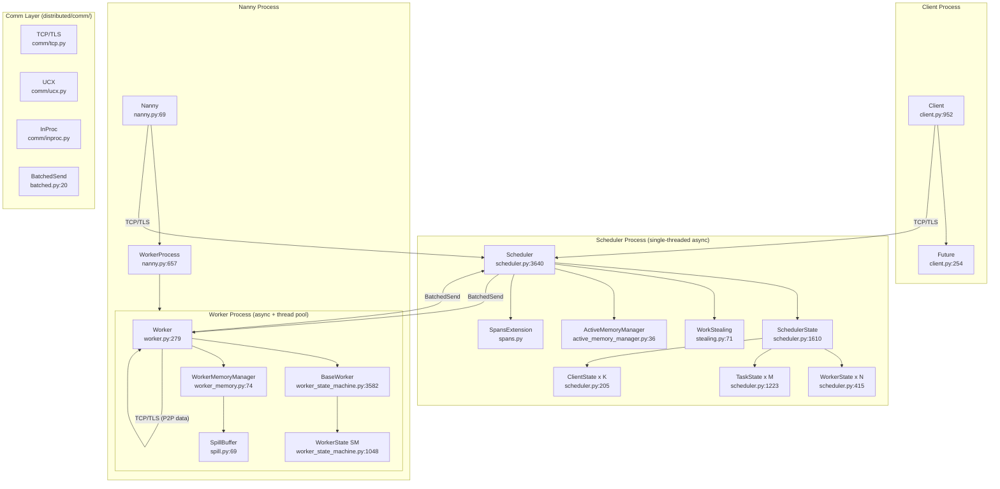
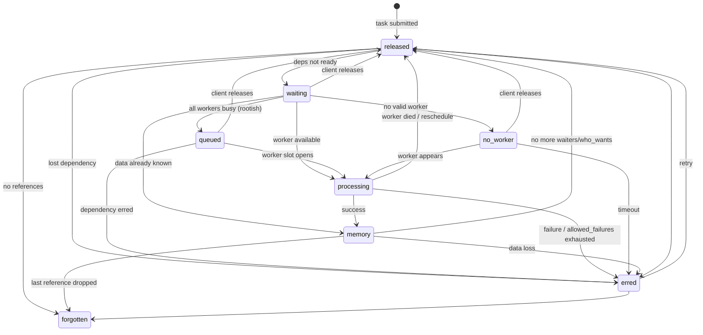
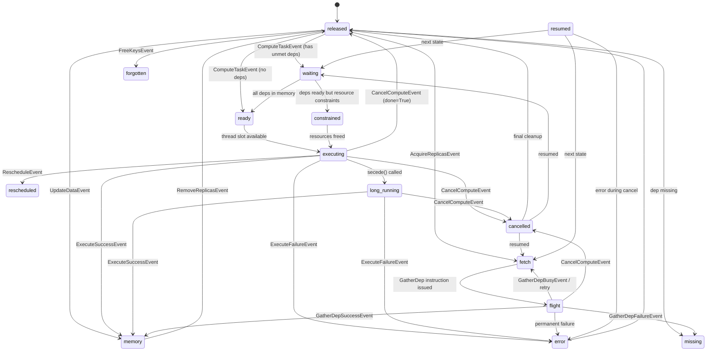

# Dask Distributed Architecture Diagram

## Component Architecture

```mermaid
graph TB
    subgraph Client["Client Process"]
        CL[Client<br/>client.py:952]
        FUT[Future<br/>client.py:254]
        CL --> FUT
    end

    subgraph Scheduler["Scheduler Process (single-threaded async)"]
        SC[Scheduler<br/>scheduler.py:3640]
        SS[SchedulerState<br/>scheduler.py:1610]
        WS_SCH[WorkerState x N<br/>scheduler.py:415]
        TS_SCH[TaskState x M<br/>scheduler.py:1223]
        CS[ClientState x K<br/>scheduler.py:205]
        WS_PLUG[WorkStealing<br/>stealing.py:71]
        AMM[ActiveMemoryManager<br/>active_memory_manager.py:36]
        SPANS[SpansExtension<br/>spans.py]
        SC --> SS
        SS --> WS_SCH
        SS --> TS_SCH
        SS --> CS
        SC --> WS_PLUG
        SC --> AMM
        SC --> SPANS
    end

    subgraph Worker["Worker Process (async + thread pool)"]
        W[Worker<br/>worker.py:279]
        BW[BaseWorker<br/>worker_state_machine.py:3582]
        WS_WRK[WorkerState SM<br/>worker_state_machine.py:1048]
        WMM[WorkerMemoryManager<br/>worker_memory.py:74]
        SB[SpillBuffer<br/>spill.py:69]
        W --> BW
        BW --> WS_WRK
        W --> WMM
        WMM --> SB
    end

    subgraph Nanny["Nanny Process"]
        NA[Nanny<br/>nanny.py:69]
        WP[WorkerProcess<br/>nanny.py:657]
        NA --> WP
        WP --> Worker
    end

    subgraph Comm["Comm Layer (distributed/comm/)"]
        TCP[TCP/TLS<br/>comm/tcp.py]
        UCX[UCX<br/>comm/ucx.py]
        INPROC[InProc<br/>comm/inproc.py]
        BATCH[BatchedSend<br/>batched.py:20]
    end

    CL -- "TCP/TLS" --> SC
    SC -- "BatchedSend" --> W
    W -- "BatchedSend" --> SC
    W -- "TCP/TLS (P2P data)" --> W
    NA -- "TCP/TLS" --> SC
```

## Scheduler TaskState Transitions

```mermaid
stateDiagram-v2
    [*] --> released : task submitted
    released --> waiting : deps not ready
    released --> forgotten : no references
    released --> erred : lost dependency
    waiting --> processing : worker available
    waiting --> queued : all workers busy (rootish)
    waiting --> no_worker : no valid worker
    waiting --> memory : data already known
    waiting --> released : client releases
    queued --> processing : worker slot opens
    queued --> released : client releases
    queued --> erred : dependency erred
    processing --> memory : success
    processing --> erred : failure / allowed_failures exhausted
    processing --> released : worker died / reschedule
    no_worker --> processing : worker appears
    no_worker --> released : client releases
    no_worker --> erred : timeout
    memory --> released : no more waiters/who_wants
    memory --> forgotten : last reference dropped
    memory --> erred : data loss
    erred --> released : retry
    erred --> forgotten
    released --> erred
```

## Worker TaskState Transitions

```mermaid
stateDiagram-v2
    [*] --> released
    released --> waiting : ComputeTaskEvent (has unmet deps)
    released --> ready : ComputeTaskEvent (no deps)
    released --> fetch : AcquireReplicasEvent
    released --> missing : dep missing
    released --> memory : UpdateDataEvent
    released --> forgotten : FreeKeysEvent
    waiting --> ready : all deps in memory
    waiting --> constrained : deps ready but resource constraints
    ready --> executing : thread slot available
    constrained --> executing : resources freed
    executing --> memory : ExecuteSuccessEvent
    executing --> error : ExecuteFailureEvent
    executing --> rescheduled : RescheduleEvent
    executing --> long_running : secede() called
    executing --> cancelled : CancelComputeEvent
    executing --> released : CancelComputeEvent (done=True)
    long_running --> memory : ExecuteSuccessEvent
    long_running --> error : ExecuteFailureEvent
    long_running --> cancelled : CancelComputeEvent
    fetch --> flight : GatherDep instruction issued
    flight --> memory : GatherDepSuccessEvent
    flight --> fetch : GatherDepBusyEvent / retry
    flight --> missing : GatherDepFailureEvent
    flight --> error : permanent failure
    flight --> cancelled : CancelComputeEvent
    cancelled --> released : final cleanup
    cancelled --> fetch : resumed
    cancelled --> waiting : resumed
    resumed --> fetch : next state
    resumed --> waiting : next state
    resumed --> error : error during cancel
    memory --> released : RemoveReplicasEvent
    error --> released
```
