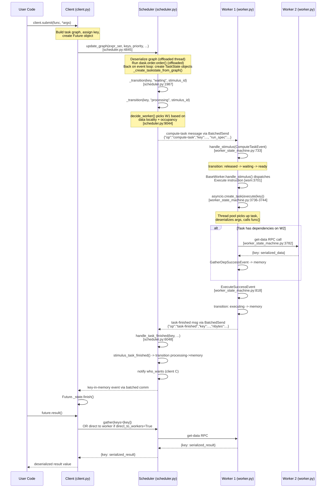
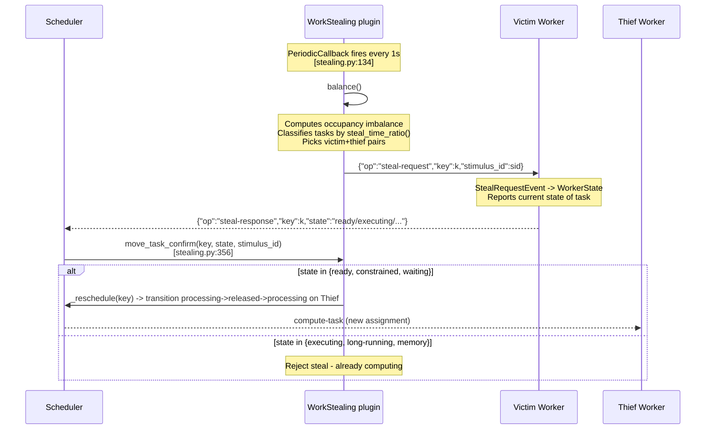

# Task Lifecycle Sequence Diagram

## Full Task Submission and Result Retrieval

```mermaid
sequenceDiagram
    participant U as User Code
    participant C as Client (client.py)
    participant S as Scheduler (scheduler.py)
    participant W1 as Worker 1 (worker.py)
    participant W2 as Worker 2 (worker.py)

    U->>C: client.submit(func, *args)
    Note over C: Build task graph, assign key,<br/>create Future object

    C->>S: update_graph(expr_ser, keys, priority, ...)<br/>[scheduler.py:4845]
    Note over S: Deserialize graph (offloaded thread)<br/>Run dask.order.order() (offloaded)<br/>Back on event loop: create TaskState objects<br/>_create_taskstate_from_graph()

    S->>S: _transition(key, "waiting", stimulus_id)<br/>[scheduler.py:1987]
    S->>S: _transition(key, "processing", stimulus_id)
    Note over S: decide_worker() picks W1 based on<br/>data locality + occupancy<br/>[scheduler.py:9044]

    S-->>W1: compute-task message via BatchedSend<br/>{"op":"compute-task","key":..., "run_spec":...}

    W1->>W1: handle_stimulus(ComputeTaskEvent)<br/>[worker_state_machine.py:733]
    Note over W1: transition: released -> waiting -> ready
    W1->>W1: BaseWorker.handle_stimulus() dispatches<br/>Execute instruction [wsm:3701]
    W1->>W1: asyncio.create_task(execute(key))<br/>[worker_state_machine.py:3736-3744]

    Note over W1: Thread pool picks up task,<br/>deserializes args, calls func()

    alt Task has dependencies on W2
        W1->>W2: get-data RPC call<br/>[worker_state_machine.py:3782]
        W2-->>W1: {key: serialized_data}
        W1->>W1: GatherDepSuccessEvent -> memory
    end

    W1->>W1: ExecuteSuccessEvent<br/>[worker_state_machine.py:818]
    W1->>W1: transition: executing -> memory
    W1-->>S: task-finished msg via BatchedSend<br/>{"op":"task-finished","key":...,"nbytes":...}

    S->>S: handle_task_finished(key, ...)<br/>[scheduler.py:6048]
    S->>S: stimulus_task_finished() -> transition processing->memory
    S->>S: notify who_wants (client C)

    S-->>C: key-in-memory event via batched comm

    C->>C: Future._state.finish()
    U->>C: future.result()
    C->>S: gather(keys=[key])<br/>OR direct to worker if direct_to_workers=True
    S->>W1: get-data RPC
    W1-->>S: {key: serialized_result}
    S-->>C: {key: serialized_result}
    C-->>U: deserialized result value
```

## Work Stealing Sequence

```mermaid
sequenceDiagram
    participant S as Scheduler
    participant WS as WorkStealing plugin
    participant Victim as Victim Worker
    participant Thief as Thief Worker

    Note over WS: PeriodicCallback fires every 1s<br/>[stealing.py:134]
    WS->>WS: balance()
    Note over WS: Computes occupancy imbalance<br/>Classifies tasks by steal_time_ratio()<br/>Picks victim+thief pairs

    WS->>Victim: {"op":"steal-request","key":k,"stimulus_id":sid}
    Note over Victim: StealRequestEvent -> WorkerState<br/>Reports current state of task

    Victim-->>S: {"op":"steal-response","key":k,"state":"ready/executing/..."}

    S->>WS: move_task_confirm(key, state, stimulus_id)<br/>[stealing.py:356]

    alt state in {ready, constrained, waiting}
        WS->>S: _reschedule(key) -> transition processing->released->processing on Thief
        S-->>Thief: compute-task (new assignment)
    else state in {executing, long-running, memory}
        Note over WS: Reject steal - already computing
    end
```
