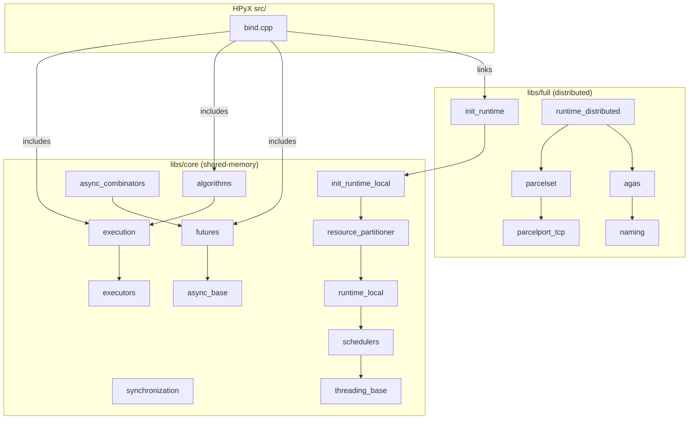
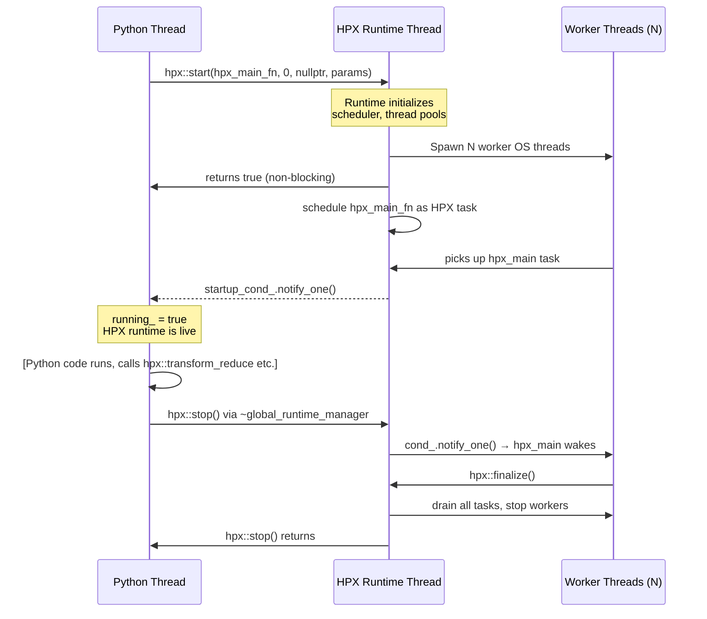

# HPX C++ Library — Master Knowledge Document for HPyX Binding Authors

**Audience**: An LLM implementing or refactoring Nanobind bindings in HPyX.
**Scope**: `vendor/hpx/` as vendored in the HPyX repo, HPX version 2.0.0 (tag 20250630).
**Date composed**: 2026-04-23.

---

## Table of Contents

1. [Overview](#1-overview)
2. [Architecture](#2-architecture)
   - 2.1 [Core vs Full split](#21-core-vs-full-split)
   - 2.2 [Runtime model](#22-runtime-model)
   - 2.3 [Scheduler and lightweight threads](#23-scheduler-and-lightweight-threads)
   - 2.4 [AGAS (brief)](#24-agas-brief)
   - 2.5 [Parcelports (brief)](#25-parcelports-brief)
3. [Module Map](#3-module-map)
4. [Core APIs Reference](#4-core-apis-reference)
   - 4.1 [Runtime init/shutdown](#41-runtime-initshutdown)
   - 4.2 [Futures and async](#42-futures-and-async)
   - 4.3 [Parallel algorithms](#43-parallel-algorithms)
   - 4.4 [Execution policies and executors](#44-execution-policies-and-executors)
   - 4.5 [Synchronization primitives](#45-synchronization-primitives)
   - 4.6 [Resource partitioner / thread pools (brief)](#46-resource-partitioner--thread-pools-brief)
5. [Binding-Author Gotchas](#5-binding-author-gotchas)
6. [Build System Notes](#6-build-system-notes)
7. [Glossary](#7-glossary)
8. [Open Questions / Assumptions](#8-open-questions--assumptions)

---

## 1. Overview

HPX (High Performance ParalleX) is a C++17 standards-conforming runtime and parallel-algorithm library that provides:

- **Lightweight tasks** (HPX threads) scheduled over a configurable pool of OS threads, enabling millions of concurrent tasks without OS-thread overhead.
- **`hpx::future<T>`** — a superset of `std::future<T>` with `.then()` continuations, `when_all`, `when_any`, and dataflow composition.
- **Parallel algorithms** that mirror the C++17 `<algorithm>` and `<numeric>` interfaces but accept HPX execution policies (`hpx::execution::par`, etc.) and optionally return futures.
- **Distributed computing** across multiple nodes (localities) via AGAS (Active Global Address Space) and parcelports — this half is large, complex, and mostly off-limits for HPyX's current scope.

HPyX's role is to expose the shared-memory, single-locality subset to Python via Nanobind. The binding code lives in `src/bind.cpp`, `src/init_hpx.cpp`, `src/algorithms.cpp`, and `src/futures.cpp`. The Python-facing API lives in `src/hpyx/`.

---

## 2. Architecture

### 2.1 Core vs Full split

All HPX modules live under `vendor/hpx/libs/`. They are subdivided into two top-level directories:

| Directory | Purpose |
|---|---|
| `vendor/hpx/libs/core/` | 84 modules — shared-memory, single-process functionality. Compiles without networking. This is what HPyX actually needs. |
| `vendor/hpx/libs/full/` | 36 modules — distributed runtime, AGAS, parcelports, components, actions, collectives. Depends on networking. HPyX links against it currently (because `HPX::hpx` and `HPX::wrap_main` pull it in), but only uses `libs/full/init_runtime` and `libs/full/include`. |

The build flag `HPX_WITH_DISTRIBUTED_RUNTIME` (default ON in vendor HPX) controls whether the full layer is compiled. HPyX's own build script (`scripts/build.sh`) sets `HPX_WITH_NETWORKING=FALSE`, which disables parcelports but keeps AGAS stubs.



### 2.2 Runtime model

HPX's runtime model separates the **control thread** (the OS thread that calls `hpx::start`) from the **HPX thread pool** (the worker OS threads managed by HPX). The key entry points are:

- `hpx::init(f, argc, argv, params)` — blocking: starts HPX, runs `f` as the HPX main function, waits for completion, returns exit code. **Not used by HPyX.**
- `hpx::start(f, argc, argv, params)` — **non-blocking**: starts the runtime on a background thread pool, schedules `f` as a new HPX thread, returns immediately. Used by HPyX.
- `hpx::stop()` — blocks the calling OS thread until the runtime finishes and all HPX threads have exited.
- `hpx::finalize()` — signals the runtime to begin shutdown; must be called from **inside** an HPX thread (typically from the `hpx_main`-style function registered with `hpx::start`).
- `hpx::suspend()` / `hpx::resume()` — pause/unpause the worker thread pools without stopping the runtime. Single-locality only.

**The HPyX suspended-runtime pattern** (`src/init_hpx.cpp`) uses `hpx::start` with a custom `hpx_main`-style function that signals Python via `std::condition_variable` and then waits on a spinlock-guarded condition. The destructor sets `rts_ = nullptr` and signals the condition, causing `hpx_main` to call `hpx::finalize()`, then the destructor calls `hpx::stop()` which blocks until clean shutdown.



### 2.3 Scheduler and lightweight threads

An HPX **lightweight thread** (also called an HPX thread or task) is a stackful coroutine allocated from a slab allocator. It has a small default stack (64 KB by default). The **scheduler** maps these onto OS threads via a run queue. When an HPX thread blocks waiting for a future, it yields its OS thread back to the scheduler rather than blocking the OS thread — this is the key performance property.

HPX ships several scheduler policies (all in `vendor/hpx/libs/core/schedulers/include/hpx/schedulers/`):

| Scheduler | Header | Notes |
|---|---|---|
| `local_priority_queue_scheduler` | `local_priority_queue_scheduler.hpp` | Default. Per-thread queues with work-stealing. |
| `static_priority_queue_scheduler` | `static_priority_queue_scheduler.hpp` | No work-stealing; tasks are pinned to specific threads. |
| `local_queue_scheduler` | `local_queue_scheduler.hpp` | Simple per-thread FIFO. |
| `shared_priority_queue_scheduler` | `shared_priority_queue_scheduler.hpp` | Shared queues, good for NUMA. |

The scheduler is chosen at runtime via config or `rp_callback`. For HPyX, the default scheduler is used.

**Calling HPX algorithms from OS threads**: when `hpx::transform_reduce(hpx::execution::par, ...)` is called from a Python OS thread (not an HPX thread), HPX internally wraps the call to run on the scheduler. This works for synchronous parallel algorithms but has subtleties for async ones — see Section 5.

### 2.4 AGAS (brief)

AGAS (Active Global Address Space) is the distributed naming service. It assigns **Global Identifiers (GIDs)** to objects (futures, components, localities) across the cluster. In single-locality mode the AGAS bootstrap is local only. HPyX never creates AGAS-managed objects directly. **Do not attempt to bind AGAS, `hpx::id_type`, components, or actions** — these require the full distributed runtime and serialization infrastructure.

### 2.5 Parcelports (brief)

Parcelports are pluggable network transport layers (TCP, MPI, LCI, LCW, GASNet). They are responsible for moving **parcels** (serialized actions) between localities. HPyX's build explicitly sets `HPX_WITH_NETWORKING=FALSE`, which disables all parcelports. If the bound HPX library was built with networking ON (e.g., the conda-forge `hpx` package), the TCP parcelport is present but HPyX disables it at runtime via `hpx.parcel.tcp.enable!=0`.

---

## 3. Module Map

The 30 most-relevant modules for HPyX, ordered roughly by importance to binding work:

| Module | Path | Purpose | Key Public Header |
|---|---|---|---|
| `algorithms` | `libs/core/algorithms/` | All parallel algorithms, `for_loop`, `transform`, `sort`, `reduce`, `transform_reduce`, etc. | `libs/core/algorithms/include/hpx/parallel/algorithm.hpp` |
| `executors` | `libs/core/executors/` | Execution policies (`seq`, `par`, `par_unseq`, `unseq`, `task`), executor types, `dataflow` | `libs/core/executors/include/hpx/executors/execution_policy.hpp` |
| `futures` | `libs/core/futures/` | `hpx::future<T>`, `hpx::shared_future<T>`, `hpx::promise<T>`, `hpx::packaged_task` | `libs/core/futures/include/hpx/futures/future.hpp` |
| `async_local` | `libs/core/async_local/` | `hpx::async`, `hpx::sync` free functions | `libs/core/async_local/include/hpx/async_local/async_fwd.hpp` |
| `async_base` | `libs/core/async_base/` | `hpx::launch` policy tags (`async`, `deferred`, `fork`, `sync`) | `libs/core/async_base/include/hpx/async_base/launch_policy.hpp` |
| `async_combinators` | `libs/core/async_combinators/` | `when_all`, `when_any`, `when_some`, `wait_all`, `wait_any`, `split_future` | `libs/core/async_combinators/include/hpx/async_combinators/when_all.hpp` |
| `execution` | `libs/core/execution/` | Execution traits, `is_execution_policy`, Sender/Receiver algorithms | `libs/core/execution/include/hpx/execution/execution.hpp` |
| `init_runtime` (full) | `libs/full/init_runtime/` | `hpx::init`, `hpx::start`, `hpx::stop`, `hpx::finalize`, `hpx::suspend`, `hpx::resume`, `hpx::init_params` | `libs/full/init_runtime/include/hpx/hpx_start.hpp` |
| `init_runtime_local` | `libs/core/init_runtime_local/` | Local (non-distributed) variant of init/start | `libs/core/init_runtime_local/include/hpx/` |
| `runtime_local` | `libs/core/runtime_local/` | `hpx::get_os_thread_count`, `hpx::get_worker_thread_num`, `hpx::run_as_hpx_thread`, `hpx::run_as_os_thread` | `libs/core/runtime_local/include/hpx/runtime_local/runtime_local.hpp` |
| `schedulers` | `libs/core/schedulers/` | Scheduler implementations (see 2.3) | `libs/core/schedulers/include/hpx/schedulers/local_priority_queue_scheduler.hpp` |
| `threading_base` | `libs/core/threading_base/` | `thread_data`, `scheduler_base`, `thread_pool_base`, stack management | `libs/core/threading_base/include/hpx/threading_base/thread_pool_base.hpp` |
| `resource_partitioner` | `libs/core/resource_partitioner/` | `hpx::resource::partitioner` — maps CPUs to thread pools | `libs/core/resource_partitioner/include/hpx/resource_partitioner/partitioner.hpp` |
| `synchronization` | `libs/core/synchronization/` | `hpx::mutex`, `hpx::condition_variable`, `hpx::latch`, `hpx::barrier`, `hpx::spinlock`, semaphores, channels | `libs/core/synchronization/include/hpx/synchronization/mutex.hpp` |
| `lcos_local` | `libs/core/lcos_local/` | Local channels (`hpx::lcos::local::channel<T>`), receive buffers | `libs/core/lcos_local/include/hpx/lcos_local/channel.hpp` |
| `coroutines` | `libs/core/coroutines/` | Stackful coroutine context-switch machinery; internal to HPX threads | (internal) |
| `threadmanager` | `libs/core/threadmanager/` | Manages all thread pools, scheduling, suspension bookkeeping | `libs/core/threadmanager/include/hpx/threadmanager/threadmanager.hpp` |
| `thread_pools` | `libs/core/thread_pools/` | Concrete `scheduled_thread_pool` implementation | `libs/core/thread_pools/include/hpx/thread_pools/scheduled_thread_pool.hpp` |
| `functional` | `libs/core/functional/` | `hpx::function<Sig>` (serializable `std::function`), `hpx::bind_front`, `hpx::move_only_function` | `libs/core/functional/include/hpx/functional/function.hpp` |
| `errors` | `libs/core/errors/` | `hpx::exception`, error codes, `hpx::error_code` | `libs/core/errors/include/hpx/errors/exception.hpp` |
| `serialization` | `libs/core/serialization/` | Portable serialization framework used by HPX actions (not needed for local-only) | (skip for HPyX) |
| `include_local` | `libs/core/include_local/` | Aggregator headers: `<hpx/execution.hpp>`, `<hpx/numeric.hpp>`, `<hpx/algorithm.hpp>` (local-only aliases) | `libs/core/include_local/include/hpx/execution.hpp` |
| `include` (full) | `libs/full/include/` | Aggregator headers: `<hpx/hpx.hpp>`, `<hpx/future.hpp>`, `<hpx/algorithm.hpp>` (full versions) | `libs/full/include/include/hpx/hpx.hpp` |
| `topology` | `libs/core/topology/` | CPU topology discovery via hwloc | `libs/core/topology/include/hpx/topology/topology.hpp` |
| `config` | `libs/core/config/` | Compile-time feature macros (`HPX_HAVE_*`) | `libs/core/config/include/hpx/config.hpp` |
| `version` | `libs/core/version/` | `hpx::complete_version()`, `hpx::build_string()` | `libs/core/version/include/hpx/version.hpp` |
| `io_service` | `libs/core/io_service/` | Asio-based I/O service thread pool | (internal) |
| `async_mpi` | `libs/core/async_mpi/` | MPI futures without distributed HPX | (optional) |
| `resiliency` | `libs/core/resiliency/` | Retry/replay policies for task resilience | (advanced, not yet bound) |
| `collectives` (full) | `libs/full/collectives/` | MPI-like broadcast/reduce over localities | (distributed, do not bind) |

---

## 4. Core APIs Reference

### 4.1 Runtime init/shutdown

All headers are under `libs/full/init_runtime/include/hpx/`.

#### `hpx::init_params`
**Header**: `vendor/hpx/libs/full/init_runtime/include/hpx/hpx_init_params.hpp`

```cpp
struct hpx::init_params {
    std::reference_wrapper<program_options::options_description const> desc_cmdline;
    std::vector<std::string> cfg;      // INI-style config strings, e.g. "hpx.os_threads!=4"
    std::function<void()> startup;     // called before hpx_main, inside HPX thread
    std::function<void()> shutdown;    // called during finalize, inside HPX thread
    hpx::runtime_mode mode;           // default_, console, worker, connect
    hpx::resource::partitioner_mode rp_mode;
    hpx::resource::rp_callback_type rp_callback; // customize thread pools
};
```

Config keys passed via `cfg` use the format `key!=value` (override) or `key=value` (default). Relevant keys for HPyX:

| Key | Effect |
|---|---|
| `hpx.os_threads!=N` | Use N OS worker threads |
| `hpx.run_hpx_main!=1` | Execute the `hpx_main` function (required for HPyX's pattern) |
| `hpx.commandline.allow_unknown!=1` | Don't error on unrecognized CLI args |
| `hpx.commandline.aliasing!=0` | Disable short aliases |
| `hpx.diagnostics_on_terminate!=0` | Suppress crash diagnostics |
| `hpx.parcel.tcp.enable!=0` | Disable TCP parcelport |

#### `hpx::start` (non-blocking)
**Header**: `vendor/hpx/libs/full/init_runtime/include/hpx/hpx_start.hpp`

```cpp
bool hpx::start(std::function<int(int, char**)> f, int argc, char** argv,
                init_params const& params = init_params());
```

Starts the HPX runtime on background OS threads and schedules `f` as the first HPX task. Returns `true` on success. The calling thread continues immediately. Call `hpx::stop()` later to drain and shut down.

#### `hpx::stop`
**Header**: `vendor/hpx/libs/full/init_runtime/include/hpx/hpx_finalize.hpp`

```cpp
int hpx::stop(hpx::error_code& ec = throws);
```

Blocks the caller until the runtime's `hpx_main` function has returned and all worker threads are joined. Must be paired with `hpx::start`. Returns the return value of `hpx_main`.

#### `hpx::finalize`
**Header**: `vendor/hpx/libs/full/init_runtime/include/hpx/hpx_finalize.hpp`

```cpp
int hpx::finalize(hpx::error_code& ec = throws);
```

Signals all localities to shut down. **Must be called from inside an HPX thread** (i.e., from within a function that was scheduled by the HPX scheduler). In HPyX's `global_runtime_manager::hpx_main`, it is called after a condition variable wait signals that Python is done.

#### `hpx::suspend` / `hpx::resume`
**Header**: `vendor/hpx/libs/full/init_runtime/include/hpx/hpx_suspend.hpp`

Pauses/resumes worker thread pools. Useful for yielding CPU when no HPX work is pending. Currently not exposed by HPyX but worth knowing.

#### `hpx::get_runtime_ptr`
Returns `hpx::runtime*` for the current locality's runtime instance. Used in `init_hpx.cpp` to check that the runtime is live.

---

### 4.2 Futures and async

#### `hpx::future<T>` and `hpx::shared_future<T>`
**Header**: `vendor/hpx/libs/core/futures/include/hpx/futures/future.hpp`

`hpx::future<T>` is a move-only, single-consumer future. It differs from `std::future<T>` in:

- `.then(launch_policy, continuation)` — attaches a non-blocking continuation that runs when the future becomes ready. Returns a new `hpx::future<U>` where `U` is the return type of `continuation`.
- `.is_ready()` — non-blocking state check.
- `.get()` — if called from an HPX thread, it **suspends** the HPX thread (yielding the OS thread) rather than blocking it.
- If called from an OS thread (non-HPX context), `.get()` spin-waits or blocks the OS thread.

`hpx::shared_future<T>` is the copyable, multi-consumer variant (like `std::shared_future<T>`).

#### `hpx::async`
**Header**: `vendor/hpx/libs/core/async_local/include/hpx/async_local/async_fwd.hpp`

```cpp
template <typename F, typename... Ts>
hpx::future<invoke_result_t<F, Ts...>> hpx::async(F&& f, Ts&&... ts);

template <typename F, typename... Ts>
hpx::future<invoke_result_t<F, Ts...>> hpx::async(launch_policy, F&& f, Ts&&... ts);
```

Launch policies live in `vendor/hpx/libs/core/async_base/include/hpx/async_base/launch_policy.hpp`:

| Policy | Token | Effect |
|---|---|---|
| `async_policy` | `hpx::launch::async` | Schedule as new HPX task immediately |
| `deferred_policy` | `hpx::launch::deferred` | Execute lazily in calling thread when `.get()` is called |
| `fork_policy` | `hpx::launch::fork` | Like async but with task-stealing hint |
| `sync_policy` | `hpx::launch::sync` | Execute synchronously in calling context |

HPyX currently uses `hpx::launch::deferred` for `hpx_async` in `src/futures.cpp`. This means Python callables are **not** dispatched to HPX worker threads; they run in the thread that calls `.get()`. This is the safe choice for Python objects because it avoids crossing the GIL boundary on an HPX thread.

#### `hpx::dataflow`
**Header**: `vendor/hpx/libs/core/executors/include/hpx/executors/dataflow.hpp`

```cpp
template <typename F, typename... Futures>
hpx::future<invoke_result_t<F, ...>> hpx::dataflow(F&& f, Futures&&... fs);
```

`dataflow` waits for all input futures to be ready, then invokes `f` with their results. Unlike chaining `.then()` calls, `dataflow` allows arbitrary fan-in. Not yet bound in HPyX.

#### `hpx::when_all` / `hpx::when_any`
**Header**: `vendor/hpx/libs/core/async_combinators/include/hpx/async_combinators/when_all.hpp`
**Header**: `vendor/hpx/libs/core/async_combinators/include/hpx/async_combinators/when_any.hpp`

```cpp
// Variadic overload:
hpx::future<hpx::tuple<hpx::future<T1>, hpx::future<T2>, ...>>
    hpx::when_all(hpx::future<T1>&&, hpx::future<T2>&&, ...);

// Range overload:
hpx::future<std::vector<hpx::future<T>>>
    hpx::when_all(InputIter first, InputIter last);
```

`when_any` returns a `hpx::future<hpx::when_any_result<Container>>` containing the index of the first ready future.

---

### 4.3 Parallel algorithms

All algorithms follow the pattern: `hpx::algorithm_name(policy, iterator_args..., function_args...)`. When `policy` is a **task policy** (`hpx::execution::par(hpx::execution::task)`), the algorithm returns `hpx::future<result>` instead of `result` — enabling asynchronous pipelines.

**Aggregator includes** (use these in binding code):
- `<hpx/algorithm.hpp>` — pulls in `libs/full/include/include/hpx/algorithm.hpp` which includes `hpx/parallel/algorithm.hpp`.
- `<hpx/numeric.hpp>` — pulls in `libs/core/include_local/include/hpx/numeric.hpp` → `hpx/parallel/numeric.hpp`.

#### `hpx::experimental::for_loop`
**Header**: `vendor/hpx/libs/core/algorithms/include/hpx/parallel/algorithms/for_loop.hpp`

```cpp
// Synchronous:
void hpx::experimental::for_loop(ExPolicy&& policy,
    I first, I last,          // integer or iterator range
    Args&&... args);          // final arg must be a callable(index_or_elem)

// Asynchronous (policy | task):
hpx::future<void> hpx::experimental::for_loop(ExPolicy&& policy, ...);
```

Note: `for_loop` lives in `hpx::experimental`, not top-level `hpx`. Variants: `for_loop_strided`, `for_loop_n`, `for_loop_n_strided`.

#### `hpx::transform_reduce`
**Header**: `vendor/hpx/libs/core/algorithms/include/hpx/parallel/algorithms/transform_reduce.hpp`

```cpp
T hpx::transform_reduce(ExPolicy&&, FwdIter first, FwdIter last,
    FwdIter2 first2, T init);                     // binary (dot product style)

T hpx::transform_reduce(ExPolicy&&, FwdIter first, FwdIter last,
    T init, ReduceOp&&, TransformOp&&);           // unary transform + reduce
```

This is the algorithm used in `src/algorithms.cpp` for `dot1d`.

#### `hpx::sort`
**Header**: `vendor/hpx/libs/core/algorithms/include/hpx/parallel/algorithms/sort.hpp`

```cpp
RandomIt hpx::sort(ExPolicy&&, RandomIt first, RandomIt last,
    Comp comp = std::less<>{});
```

#### `hpx::transform`
**Header**: `vendor/hpx/libs/core/algorithms/include/hpx/parallel/algorithms/transform.hpp`

```cpp
result_type hpx::transform(ExPolicy&&, FwdIter first, FwdIter last,
    OutIter dest, UnaryOp&&);
```

#### `hpx::reduce`
**Header**: `vendor/hpx/libs/core/algorithms/include/hpx/parallel/algorithms/reduce.hpp`

```cpp
T hpx::reduce(ExPolicy&&, FwdIter first, FwdIter last, T init, BinaryOp&&);
T hpx::reduce(ExPolicy&&, FwdIter first, FwdIter last, T init);
```

#### Other notable algorithms (all in `libs/core/algorithms/include/hpx/parallel/algorithms/`):

| Algorithm | Header file |
|---|---|
| `for_each` | `for_each.hpp` |
| `copy`, `copy_if` | `copy.hpp` |
| `fill`, `fill_n` | `fill.hpp` |
| `count`, `count_if` | `count.hpp` |
| `find`, `find_if` | `find.hpp` |
| `inclusive_scan`, `exclusive_scan` | `inclusive_scan.hpp`, `exclusive_scan.hpp` |
| `iota` | `iota.hpp` |
| `merge`, `sort`, `stable_sort` | `merge.hpp`, `sort.hpp`, `stable_sort.hpp` |
| `all_of`, `any_of`, `none_of` | `all_any_none.hpp` |

---

### 4.4 Execution policies and executors

**Header**: `vendor/hpx/libs/core/executors/include/hpx/executors/execution_policy.hpp`

The six standard policy objects:

| Object | Type alias | Meaning |
|---|---|---|
| `hpx::execution::seq` | `sequenced_policy` | Sequential; uses `sequenced_executor` |
| `hpx::execution::par` | `parallel_policy` | Parallel; uses `parallel_executor` (HPX thread pool) |
| `hpx::execution::par_unseq` | `parallel_unsequenced_policy` | Parallel + SIMD vectorization hints |
| `hpx::execution::unseq` | `unsequenced_policy` | SIMD only, single thread |
| `hpx::execution::task` (tag) | `task_policy_tag` | Appended to par/seq to make async variant |
| `hpx::execution::non_task` (tag) | `non_task_policy_tag` | Strip the task tag |

**Making an async policy**: `hpx::execution::par(hpx::execution::task)` returns a `parallel_task_policy` which causes algorithms to return `hpx::future<result>`.

**Executor types** (in `vendor/hpx/libs/core/executors/include/hpx/executors/`):

| Executor | Header | Notes |
|---|---|---|
| `parallel_executor` | `parallel_executor.hpp` | Default for `par`; dispatches to HPX thread pool |
| `sequenced_executor` | `sequenced_executor.hpp` | Default for `seq`; runs in calling thread |
| `fork_join_executor` | `fork_join_executor.hpp` | Fork-join with reusable threads; low overhead for bulk work |
| `thread_pool_executor` | `thread_pool_executor.hpp` | Wraps a specific `hpx::thread_pool_base` |
| `limiting_executor<E>` | `limiting_executor.hpp` | Wraps another executor with a task count limit |
| `annotating_executor<E>` | `annotating_executor.hpp` | Adds task names for profiling |
| `service_executor` | `service_executors.hpp` | Runs on the Asio I/O thread pool |

Executors can be bound to a policy: `hpx::execution::par.on(my_executor)`.

**Chunk size parameters** (in `vendor/hpx/libs/core/execution/include/hpx/execution/executors/`):

| Parameter | Purpose |
|---|---|
| `static_chunk_size(n)` | Fixed n elements per task |
| `dynamic_chunk_size(n)` | Dynamic load-balancing chunks |
| `auto_chunk_size()` | Automatic chunk sizing |
| `guided_chunk_size()` | Guided (shrinking) chunks |

Applied via: `hpx::execution::par.with(hpx::execution::static_chunk_size(1000))`.

---

### 4.5 Synchronization primitives

All in `vendor/hpx/libs/core/synchronization/include/hpx/synchronization/`.

| Primitive | Header | Notes |
|---|---|---|
| `hpx::mutex` | `mutex.hpp` | HPX-aware mutex; yields HPX thread on contention |
| `hpx::recursive_mutex` | `recursive_mutex.hpp` | Re-entrant variant |
| `hpx::shared_mutex` | `shared_mutex.hpp` | Reader-writer lock |
| `hpx::condition_variable` | `condition_variable.hpp` | HPX-aware condition variable |
| `hpx::condition_variable_any` | `condition_variable.hpp` | Works with any lockable |
| `hpx::spinlock` | `spinlock.hpp` | Busy-wait; does NOT yield HPX thread — use only for very short critical sections |
| `hpx::latch` | `latch.hpp` | C++20 `std::latch` equivalent |
| `hpx::barrier<F>` | `barrier.hpp` | C++20 `std::barrier` equivalent |
| `hpx::counting_semaphore<N>` | `counting_semaphore.hpp` | C++20 equivalent |
| `hpx::binary_semaphore` | `binary_semaphore.hpp` | Convenience alias |
| `hpx::lcos::local::channel<T>` | `../lcos_local/channel.hpp` | SPSC/MPSC/MPMC channels |

**Distinction between `hpx::spinlock` and `hpx::mutex`**: `spinlock` never suspends the calling thread; it busy-waits. This is appropriate only when the critical section is guaranteed to be very short (e.g., a flag flip) and the code may be running on a context where suspending is not possible. `hpx::mutex` suspends the HPX thread on contention, yielding the OS thread for other work. In `src/init_hpx.cpp`, `hpx::spinlock` is used to protect the `rts_` pointer because the code runs in `hpx_main` (an HPX thread) with a very short critical section.

---

### 4.6 Resource partitioner / thread pools (brief)

**Header**: `vendor/hpx/libs/core/resource_partitioner/include/hpx/resource_partitioner/partitioner.hpp`

The resource partitioner divides hardware PUs (processing units) into named thread pools. The default pool is called `"default"` and receives all available cores. A binding author can add custom thread pools via the `rp_callback` in `init_params`:

```cpp
params.rp_callback = [](hpx::resource::partitioner& rp, ...) {
    rp.create_thread_pool("io_pool");
    rp.add_resource(rp.numa_domains()[0].cores()[0].pus()[0], "io_pool");
};
```

HPyX does not currently expose this. For Python, the simple approach is to configure `hpx.os_threads` to control thread count.

---

## 5. Binding-Author Gotchas

This section is the most important for anyone adding or modifying bindings.

### 5.1 The GIL and HPX worker threads

HPX worker threads are bare OS threads managed by HPX, not Python threads. They do **not** hold the GIL. Any callback that touches a Python object (`nb::object`, `nb::callable`, or any Nanobind type) from an HPX worker thread will cause undefined behavior (heap corruption, segfault) unless the GIL is explicitly acquired.

**Rules**:

1. **Acquiring GIL before calling Python from an HPX thread**: use `nb::gil_scoped_acquire acquire;` inside lambdas that will execute on HPX threads.

2. **Releasing GIL before blocking HPX operations**: use `nb::gil_scoped_release release;` before any `hpx::future<T>::get()`, `hpx::stop()`, or other blocking HPX call that may suspend the Python thread for a non-trivial duration. This allows other Python threads to run while waiting.

3. **Do not hold the GIL across `hpx::start`**: `src/init_hpx.cpp` acquires the GIL during `init_hpx_runtime` (which just constructs `global_runtime_manager`), but `hpx::start` itself returns quickly. The actual worker threads are created GIL-free.

4. **`hpx::launch::deferred` is GIL-safe**: because deferred futures execute in the thread that calls `.get()`. If `.get()` is called from the Python thread (holding the GIL), the callable runs in that same thread with the GIL held. This is why `src/futures.cpp` uses `deferred`.

5. **`hpx::launch::async` requires explicit GIL acquire**: when a Python callable is wrapped in an `hpx::async(hpx::launch::async, ...)` call, the lambda must acquire the GIL before invoking the callable.

6. **Parallel algorithms on Python objects**: `hpx_for_loop` in `src/algorithms.cpp` calls Python objects from within `hpx::experimental::for_loop(..., hpx::execution::par, ...)`. Currently the `par` policy path is NOT implemented in the Python layer (`_for_loop.py` raises `NotImplementedError` for `par`). This is intentional — parallel callbacks on Python objects require GIL acquire/release on each iteration and create severe contention. The only safe parallel algorithm pattern for Python is operating on raw C++ data (e.g., `double*` from numpy arrays) without touching `nb::object`.

### 5.2 `hpx::future<T>` lifetime and Nanobind

`hpx::future<T>` is move-only. When binding `hpx::future<nb::object>`:

- The `.get()` call must NOT release the GIL if the future was created with `launch::deferred` (the callable runs in the calling thread, needs GIL for Python call).
- The `.get()` call SHOULD release the GIL if the future was created with `launch::async` (the callable runs on an HPX thread, GIL is not held there; calling `.get()` only waits).
- Nanobind's `nb::class_<hpx::future<T>>` holds the future by value. Moving a future into Python hands requires careful bind: the `.def("get", ...)` lambda must capture by reference or the future may be moved-from before the user calls `.get()`.
- `hpx::future` is **not default-constructible with a valid state** — `hpx::future<T>()` creates an invalid future. Calling `.get()` on an invalid future throws `hpx::exception`.

### 5.3 Single-runtime constraint

HPX can only have one active runtime per process. The `global_runtime_manager* rts` singleton in `src/init_hpx.cpp` enforces this for HPyX. Calling `init_hpx_runtime()` a second time before `stop_hpx_runtime()` is a no-op (the `if (rts == nullptr)` guard). However, once `stop_hpx_runtime()` is called and the runtime is destroyed, **it cannot be restarted in the same process**. Attempting to call `hpx::start` again after `hpx::stop` has completed results in undefined behavior.

This means:
- `HPXRuntime` and `HPXExecutor` instances cannot be created more than once per process lifetime.
- Tests that use `HPXRuntime` in a `with` block must not create a second one.

### 5.4 `hpx::finalize` must be called from an HPX thread

`hpx::finalize()` must execute in an HPX thread context. In `global_runtime_manager::hpx_main`, it is called from the function that was passed to `hpx::start` — that function runs as an HPX thread. Calling `hpx::finalize()` from a plain OS thread (like the Python main thread) is incorrect and may hang or crash.

### 5.5 HPX parallel algorithms require C++ iterators, not Python iterables

`hpx::experimental::for_loop` and related algorithms take C++ iterators or integer ranges. The current binding in `src/algorithms.cpp` converts Python iterables to integer indices and uses `iterable[i]`. This:
- Acquires the GIL implicitly inside the lambda for each element access (via Nanobind's Python object protocol).
- Does NOT release the GIL between iterations.
- Therefore, `par` execution with Python object access provides no speedup and may deadlock if the GIL is not managed correctly.

For real parallelism, algorithms must operate on raw pointers (e.g., `double*` obtained from `nb::ndarray.data()`), as demonstrated by `dot1d` using `hpx::transform_reduce` on `const double*`.

### 5.6 `hpx::function` vs `std::function`

HPyX's `init_hpx.cpp` uses `hpx::function<int(int, char**)>` (from `vendor/hpx/libs/core/functional/include/hpx/functional/function.hpp`). This is a **serializable** function wrapper intended for use with HPX actions (distributed dispatch). For local-only use, `std::function` works equally well. New binding code should prefer `std::function` unless the callable needs to cross locality boundaries (it doesn't in HPyX's scope).

### 5.7 Executor and policy object lifetime

Execution policy objects (`hpx::execution::par`, etc.) are `constexpr` global singletons. They are safe to use from any thread. Custom executor objects (e.g., `fork_join_executor`) must outlive all tasks dispatched through them. If a custom executor is created on the stack of a bound function and the function returns before all tasks complete, the executor is destroyed while tasks are still running — undefined behavior.

### 5.8 Python free-threaded mode (3.13t)

HPyX targets `python-freethreading = 3.13.*` (the GIL-optional build). The Nanobind module is compiled with `FREE_THREADED` flag (`CMakeLists.txt`). In free-threaded Python, `nb::gil_scoped_acquire` / `nb::gil_scoped_release` are still meaningful because HPX worker threads are not Python threads and do not participate in Python's thread state. GIL management patterns from Section 5.1 remain correct.

### 5.9 Stack size and deep recursion

HPX lightweight threads default to 64 KB stacks. Deep Python call stacks (e.g., recursive functions, large generator chains) triggered inside an HPX-scheduled callable may overflow the lightweight thread stack. When binding operations that may use substantial stack (e.g., NumPy operations that call back into Python), prefer `hpx::launch::deferred` (which runs on the calling OS thread with its normal stack) over `hpx::launch::async`.

### 5.10 `hpx::spinlock` vs `std::mutex` in binding code

The `init_hpx.cpp` file mixes `hpx::spinlock` (for `mtx_` / `cond_`) with `std::mutex` (for `startup_mtx_`). The `hpx::condition_variable_any` works with `hpx::spinlock`. Do NOT use `std::condition_variable` with `hpx::spinlock` — it requires `std::mutex`. Conversely, `hpx::condition_variable` requires an `hpx::mutex` (or compatible HPX lockable). The `startup_mtx_` / `startup_cond_` pair uses standard primitives intentionally because the wait occurs before HPX is fully initialized.

---

## 6. Build System Notes

### 6.1 How HPyX consumes vendor/hpx

HPyX does **not** build HPX from source in normal operation. It expects an installed HPX package found by CMake `find_package(HPX REQUIRED)`. The vendor submodule at `vendor/hpx/` is used only when building HPX from source via `scripts/build.sh` (the `hpx-src` pixi feature).

From `CMakeLists.txt`:

```cmake
find_package(HPX REQUIRED)
nanobind_add_module(_core FREE_THREADED src/bind.cpp src/init_hpx.cpp
                    src/algorithms.cpp src/futures.cpp)
target_link_libraries(_core PRIVATE
    HPX::hpx            # main HPX library
    HPX::wrap_main      # wraps main() to init HPX machinery
    HPX::iostreams_component  # hpx::cout support
)
```

`HPX::wrap_main` provides a replacement `main()` entry point that bootstraps HPX command line processing. This is needed because `hpx::start` internally uses Boost.ProgramOptions to parse `argc/argv`.

### 6.2 Key HPX CMake options when building from source

From `vendor/hpx/CMakeLists.txt` and `scripts/build.sh`:

| Option | Default | HPyX usage |
|---|---|---|
| `HPX_WITH_DISTRIBUTED_RUNTIME` | ON | ON (hard to disable; keep default) |
| `HPX_WITH_NETWORKING` | ON (if distributed) | **OFF** in HPyX build — disables all parcelports |
| `HPX_WITH_EXAMPLES` | ON | OFF in HPyX build |
| `HPX_WITH_TESTS` | ON | OFF in HPyX build |
| `HPX_WITH_MALLOC` | system | `system` (Linux), can be `jemalloc`, `tcmalloc` |
| `HPX_WITH_APEX` | OFF | OFF — performance counter framework, not needed |
| `HPX_WITH_CUDA` | OFF | OFF (no GPU support in current HPyX) |
| `HPX_WITH_MAX_CPU_COUNT` | 64 | Default; increase for large-core machines |
| `HPX_WITH_LOGGING` | ON | ON in debug builds |

The conda-forge `hpx>=1.11.0` package (used in production environments via `pixi.toml`) is built with `HPX_WITH_NETWORKING=ON` but disables TCP at runtime via the HPyX config string `hpx.parcel.tcp.enable!=0`.

### 6.3 Required C++ standard

HPX 2.0 requires C++17. HPyX's `CMakeLists.txt` sets `CMAKE_CXX_STANDARD 17`. HPX headers use C++17 features throughout (structured bindings, `if constexpr`, fold expressions, `std::optional`). Do not attempt to build with C++14.

### 6.4 Module skeleton pattern

Every module under `libs/core/` and `libs/full/` follows this structure:

```
libs/core/<module_name>/
    CMakeLists.txt           # registers module targets
    include/
        hpx/
            <module_name>/   # public headers
    src/
        CMakeLists.txt
        *.cpp                # implementation (private)
    tests/
    docs/
```

Public headers are installed to `$PREFIX/include/hpx/<module_name>/`. The aggregator headers in `libs/core/include_local/include/hpx/` and `libs/full/include/include/hpx/` pull in groups of modules.

---

## 7. Glossary

| Term | Definition |
|---|---|
| **Locality** | A single HPX process instance, identified by a locality ID (integer). Single-process HPyX always has locality 0. |
| **HPX thread** (lightweight thread) | A stackful coroutine scheduled by HPX onto OS threads. Can suspend and yield without blocking the OS thread. Analogous to a Go goroutine. |
| **OS thread** | A standard operating-system thread. HPX creates N of these as worker threads (N = `hpx.os_threads`). |
| **Task** | Synonymous with HPX thread in HPX 2.x terminology. |
| **Suspension** | When an HPX thread calls `.get()` on a not-yet-ready future, it saves its context and yields the OS thread, allowing the scheduler to run another task. |
| **Scheduler** | The component that picks the next ready HPX thread to run on each OS thread. Multiple scheduler policies are available (see 2.3). |
| **Thread pool** | A named group of OS threads managed by the scheduler. The default pool is named `"default"`. |
| **Execution policy** | An object (`seq`, `par`, `par_unseq`, `unseq`) that controls how a parallel algorithm distributes work. |
| **Executor** | A concrete type that maps an execution policy to actual task dispatch. The default executor for `par` is `parallel_executor`. |
| **`hpx_main`** | A user-provided function registered with `hpx::start` or `hpx::init` that serves as the entry point for HPX application logic. In HPyX, this is `global_runtime_manager::hpx_main`. |
| **Future** | An `hpx::future<T>` representing a value that will be available asynchronously. Supports `.then()` continuations and fan-in combinators. |
| **Launch policy** | Controls how `hpx::async` schedules work: `async` (new HPX task), `deferred` (lazy in calling thread), `fork` (like async with stealing hint), `sync` (immediate). |
| **Parcel** | A network message carrying a serialized HPX action and its arguments between localities. Not relevant for single-locality HPyX. |
| **Parcelport** | The pluggable network transport layer for parcels (TCP, MPI, etc.). Disabled in HPyX's single-locality mode. |
| **AGAS** | Active Global Address Space. The distributed naming service that gives every HPX object a globally unique address. In single-locality mode, AGAS is local and transparent. |
| **GID** | Global Identifier. A 128-bit address managed by AGAS. Used by components, futures, and localities in distributed mode. Not directly manipulated by HPyX. |
| **Action** | A C++ function registered with HPX's action framework so it can be remotely invoked on another locality. Requires serialization. Not bound by HPyX. |
| **Component** | A distributed object whose methods are invocable as HPX actions. Requires the full distributed runtime. Not bound by HPyX. |
| **Resource partitioner** | The component that maps hardware topology (NUMA nodes, cores, PUs) to named thread pools. |
| **`hpx::spinlock`** | A busy-wait mutex that does NOT yield HPX threads on contention. Use only for very short critical sections where yielding would be more expensive than spinning. |
| **`hpx::dataflow`** | A function that waits for multiple input futures and then invokes a continuation, enabling data dependency graphs. |
| **Chunk size** | The number of elements assigned to a single HPX task by a parallel algorithm. Controlled by executor parameters like `static_chunk_size`. |
| **GIL** | Python's Global Interpreter Lock. HPX worker threads do not hold it. Any HPX callback that touches Python objects must acquire it explicitly via `nb::gil_scoped_acquire`. |

---

## 8. Open Questions / Assumptions

The following items were inferred rather than confirmed by reading every relevant file. Confidence levels are indicated.

| Item | Confidence | Notes |
|---|---|---|
| HPX version in vendor is 2.0.0 | **Confirmed** | `CMakeLists.txt`: `HPX_VERSION_MAJOR 2`, `HPX_VERSION_MINOR 0`, `HPX_VERSION_SUBMINOR 0`, date 20250630. |
| `hpx::launch::deferred` runs in the `.get()` calling thread | **Confirmed** | Documented in `hpx_start.hpp` and consistent with HPX docs. |
| Parallel algorithms called from OS threads (not HPX threads) work correctly | **High** | HPX internally wraps such calls. The `dot1d` example in `src/algorithms.cpp` is evidence it works. However, performance characteristics when called from a Python thread vs HPX thread may differ. |
| `HPX::wrap_main` is required for `hpx::start` to work from a Python extension module | **High** | Without `wrap_main`, command-line argument parsing in HPX may fail. Observed in `CMakeLists.txt`. Exact behavior without it is not confirmed by reading its source. |
| Free-threaded Python 3.13t with HPX does not require any changes to GIL patterns | **Medium** | Nanobind handles the GIL acquisition/release API changes internally. HPX worker threads are not Python threads regardless of GIL mode. The `FREE_THREADED` nanobind flag enables building against the free-threaded Python ABI, but the GIL still exists (it's just optional for Python threads). |
| The `task` execution policy modifier (`par(task)`) is safe to use from Python OS threads | **Medium** | This returns a future immediately and schedules work on HPX threads. Confirmed as a valid pattern in HPX docs, but not tested in HPyX. |
| `hpx::stop()` is safe to call after the HPX runtime has already been stopped | **Low** | Not confirmed. The destructor guard `if (r != nullptr)` avoids double-free of the manager, but whether `hpx::stop()` itself is safe to call if the runtime stopped prematurely (e.g., due to `hpx::terminate()`) is unknown. |
| The conda-forge `hpx >= 1.11.0` package ABI is compatible with HPX 2.0.0 headers in vendor | **Medium** | `pixi.toml` uses `hpx = ">=1.11.0,<2"` from conda-forge while vendor is 2.0.0. There is a mismatch: when building from the conda-forge package, the vendored headers are not used (CMake's `find_package(HPX)` finds the installed headers). The vendor submodule is only used for source builds. Confirmed by reading `CMakeLists.txt`. |
| `HPX_WITH_DISTRIBUTED_RUNTIME=OFF` would produce a smaller, simpler library | **Confirmed** | The CMake option documentation explicitly states this. However, HPyX's build scripts do not disable it, so the full init machinery (including AGAS stubs) is always compiled. |
| Stack overflow is a real risk for deeply recursive Python functions in HPX tasks | **Medium** | HPX default stack is 64 KB. Python call frames are roughly 1-4 KB each. A recursion depth of ~100 in a deferred future (which runs on the calling OS thread) is safe. A recursion depth of ~100 in an async future (on an HPX thread) could overflow. Exact threshold depends on the platform and function complexity. |

---

*Document composed by static analysis of `vendor/hpx/` (HPX 2.0.0), `src/` binding code, `CMakeLists.txt`, `scripts/build.sh`, and `pixi.toml`. No code was executed during analysis.*
