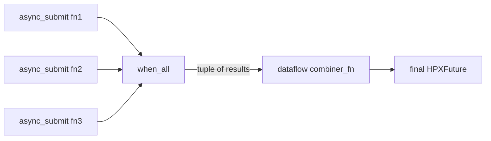
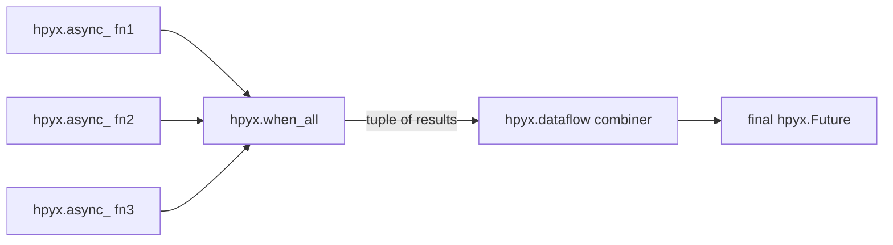
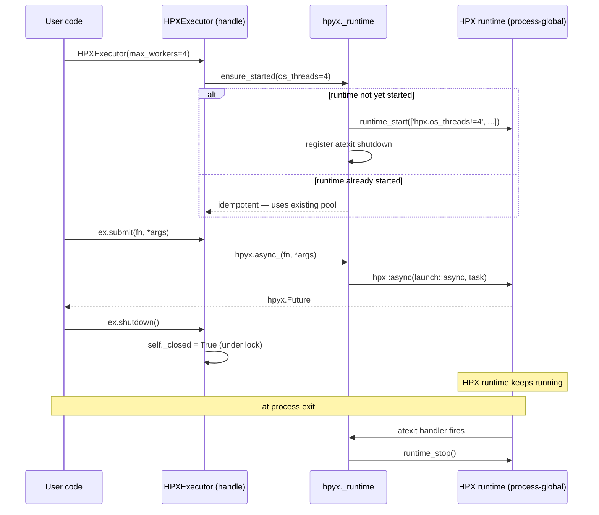
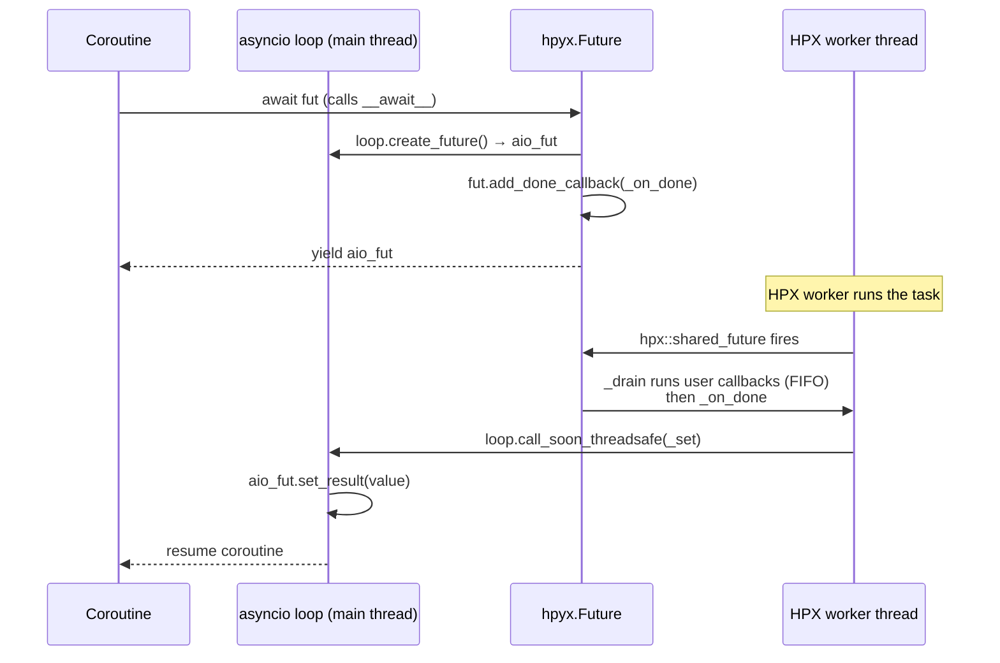

# HPyX Usage Guide

This guide provides comprehensive examples and usage patterns for HPyX, the Python bindings for the HPX C++ Parallelism Library. HPyX enables high-performance parallel computing in Python by leveraging HPX's advanced parallel execution capabilities.

!!! note "v1 API"
    HPyX v1 introduces a new runtime lifecycle — the HPX runtime now **auto-initializes** on first use. `hpyx.init()` replaces the old `HPXRuntime(...)` kwargs pattern.
    See [Runtime Management](#runtime-management) for the full details.

## Table of Contents

1. [Getting Started](#getting-started)
2. [Runtime Management](#runtime-management)
3. [Configuration](#configuration)
4. [Diagnostics](#diagnostics)
5. [Asynchronous Programming with Futures](#asynchronous-programming-with-futures)
6. [The HPXExecutor](#the-hpxexecutor)
7. [asyncio Integration](#asyncio-integration)
8. [Parallel Processing with for_loop](#parallel-processing-with-for_loop)
9. [Working with NumPy](#working-with-numpy)
10. [Error Handling](#error-handling)
11. [Performance Considerations](#performance-considerations)
12. [Best Practices](#best-practices)

## Getting Started

HPyX provides a clean Python interface to HPX's parallel computing capabilities. The main components are:

- `hpyx.init()` / `hpyx.shutdown()` / `hpyx.is_running()` — runtime lifecycle
- `HPXRuntime` — optional context manager for explicit scoping
- `hpyx.config` — environment-variable-driven configuration
- `hpyx.debug` — worker thread diagnostics
- `hpyx.async_` / `hpyx.Future` — submit functions for asynchronous execution
- `hpyx.when_all` / `hpyx.when_any` / `hpyx.dataflow` / `hpyx.shared_future` / `hpyx.ready_future` — future composition
- `hpyx.HPXExecutor` — drop-in `concurrent.futures.Executor` (works with `asyncio.run_in_executor`, `dask.compute`, etc.)
- `hpyx.aio.await_all` / `hpyx.aio.await_any` — asyncio-friendly future combinators (`await fut` and `asyncio.wrap_future` also Just Work)
- `hpyx.multiprocessing.for_loop` — parallel iteration over collections

### Basic Import

```python
import hpyx
from hpyx.multiprocessing import for_loop
```

## Runtime Management

### Auto-initialization (recommended)

In v1, HPyX **auto-initializes** the HPX runtime the first time any API that needs it is called. You do not need to call `hpyx.init()` explicitly unless you want to configure thread count before the first use.

```python
import hpyx

# Runtime starts automatically on first submit
future = hpyx.async_(lambda: 42)
print(future.result())  # 42
```

### Explicit initialization

Call `hpyx.init()` before any parallel work if you want to control the thread count or pass custom HPX config strings:

```python
import hpyx

hpyx.init(os_threads=8)          # use 8 HPX worker threads
# or with extra HPX cfg strings:
hpyx.init(os_threads=4, cfg=["hpx.stacks.small_size=0x20000"])
```

`hpyx.init()` is **idempotent** — calling it multiple times with the same arguments is a no-op. Calling it with *different* arguments after the runtime is already running raises `RuntimeError` (HPX cannot be reconfigured in-process).

```python
hpyx.init(os_threads=4)
hpyx.init(os_threads=4)  # OK — no-op
hpyx.init(os_threads=8)  # RuntimeError: already started with different config
```

### Querying runtime state

```python
import hpyx

print(hpyx.is_running())  # True once started, False before first init
```

### Shutdown

HPyX registers an `atexit` handler on first start, so **you normally do not need to call `hpyx.shutdown()` explicitly**. It will run automatically when the Python process exits.

If you need to force an early shutdown (e.g., in a test harness):

```python
hpyx.shutdown()
# HPX cannot restart within the same process after shutdown
```

!!! warning "HPX cannot restart"
    Once `hpyx.shutdown()` is called (or the atexit handler fires), calling `hpyx.init()` again in the same process raises `RuntimeError`. Plan your process lifecycle accordingly.

### HPXRuntime context manager

`HPXRuntime` is an optional convenience wrapper. It calls `hpyx.init()` on `__enter__` and is a no-op on `__exit__` — it does **not** shut the runtime down when the `with` block exits (HPX cannot restart).

```python
from hpyx import HPXRuntime

with HPXRuntime(os_threads=4):
    # runtime is guaranteed to be running here
    import hpyx
    future = hpyx.async_(lambda: "hello from HPX")
    print(future.result())

# runtime is still running here — atexit owns shutdown
print(hpyx.is_running())  # True
```

`HPXRuntime` is most useful when you want to be explicit about the startup point in a script or test, or for backward compatibility with v0.x code.

## Configuration

### Environment variables

HPyX reads configuration from environment variables at runtime startup. These take effect when `hpyx.init()` (or auto-init) first runs.

| Variable | Type | Default | Description |
|---|---|---|---|
| `HPYX_OS_THREADS` | int | `None` (HPX default) | Number of HPX worker OS threads |
| `HPYX_CFG` | str | `""` | Semicolon-separated HPX config strings |
| `HPYX_AUTOINIT` | bool | `true` | Set to `0`/`false` to disable auto-init |
| `HPYX_TRACE_PATH` | str | `None` | Path for JSONL trace output (v1.x) |
| `HPYX_ASYNC_MODE` | str | `"async"` | `"async"` (default) or `"deferred"` — emergency rollback to v0.x `hpx::launch::deferred` semantics |

**Precedence:** explicit `hpyx.init()` kwargs > environment variables > built-in defaults.

```bash
# Run with 16 HPX threads
HPYX_OS_THREADS=16 python my_script.py

# Disable auto-init (require explicit hpyx.init() call)
HPYX_AUTOINIT=0 python my_script.py

# Pass HPX config strings
HPYX_CFG="hpx.stacks.small_size=0x20000;hpx.os_threads!=4" python my_script.py
```

### Reading config programmatically

```python
from hpyx import config

# See all defaults
print(config.DEFAULTS)
# {'os_threads': None, 'cfg': [], 'autoinit': True, 'trace_path': None}

# Read current env-var layer
cfg = config.from_env()
print(cfg["os_threads"])   # e.g. 8 if HPYX_OS_THREADS=8 is set, else None
```

### Disabling auto-init

Set `HPYX_AUTOINIT=0` to require an explicit `hpyx.init()` call before any HPyX API is used. This is useful in library code where you want the caller to control when the runtime starts.

```python
# With HPYX_AUTOINIT=0 in the environment:
import hpyx

# This would raise RuntimeError without an explicit init:
hpyx.init(os_threads=4)  # must come first

future = hpyx.async_(lambda: 42)
print(future.result())
```

## Diagnostics

The `hpyx.debug` module exposes worker thread introspection.

```python
import hpyx
from hpyx import debug

hpyx.init(os_threads=4)

# Number of HPX worker OS threads in the default pool
print(debug.get_num_worker_threads())  # 4

# Thread id of the calling thread (-1 if not an HPX worker thread)
print(debug.get_worker_thread_id())    # -1 (called from main Python thread)
```

`get_worker_thread_id()` returns `-1` when called from a non-HPX thread (e.g., the Python main thread or a `threading.Thread`). When called from within an HPX task it returns the 0-based worker index.

!!! note "Tracing"
    `debug.enable_tracing(path)` and `debug.disable_tracing()` are stubbed in v1.0 and raise `NotImplementedError`. Full JSONL-output tracing ships in v1.x (Plan 4).

## Asynchronous Programming with Futures

HPyX provides futures-based asynchronous programming through the top-level `hpyx.async_` function, which submits a callable to an HPX worker thread and returns a `hpyx.Future` for its result.

!!! info "v1 API change"
    `hpyx.async_` and `hpyx.Future` replace the v0.x `hpyx.futures.submit` shim.
    The new API conforms to the `concurrent.futures.Future` protocol so it
    integrates with `asyncio`, `dask`, and any code that already targets the
    stdlib. See [The Pythonic `hpyx.Future` wrapper](#the-pythonic-hpyxfuture-wrapper)
    below for the full reference.

### Basic Future Usage

```python
import hpyx

def add(a, b):
    return a + b

# Runtime auto-initializes on first call
future = hpyx.async_(add, 5, 3)
result = future.result()
print(f"5 + 3 = {result}")  # Output: 5 + 3 = 8
```

### Multiple Futures

```python
import hpyx

def square(x):
    return x * x

futures = [hpyx.async_(square, i) for i in range(5)]
results = [f.result() for f in futures]
print(f"Squares: {results}")  # Output: Squares: [0, 1, 4, 9, 16]
```

### Complex Data Types

```python
import hpyx

def process_data(data_dict):
    return {
        'sum': sum(data_dict['values']),
        'count': len(data_dict['values']),
        'avg': sum(data_dict['values']) / len(data_dict['values'])
    }

input_data = {'values': [1, 2, 3, 4, 5]}
future = hpyx.async_(process_data, input_data)
result = future.result()
print(f"Statistics: {result}")
# Output: Statistics: {'sum': 15, 'count': 5, 'avg': 3.0}
```

### Lambda Functions

```python
import hpyx

future = hpyx.async_(lambda x: x ** 2 + 2 * x + 1, 5)
print(future.result())  # 36
```

### Combinators (`when_all`, `when_any`, `dataflow`, `shared_future`)

The `hpyx._core.futures` submodule exposes four composition primitives that
operate on the underlying `HPXFuture`. They are the building blocks of the
public `hpyx.futures` Pythonic wrapper that ships in a follow-up task.

!!! note "Working with `HPXFuture` directly"
    The combinators below take and return `HPXFuture` instances obtained from
    `core_futures.async_submit(...)` or `core_futures.ready_future(...)`. The
    user-facing `hpyx.futures.Future` wrapper (with `__await__` and the full
    `concurrent.futures.Future` protocol) is a thin shell over these.

```python
import hpyx
from hpyx._core import futures as core_futures

hpyx.init(os_threads=4)
```

#### `when_all(inputs) -> HPXFuture`

Returns a future whose result is a tuple of all input results in input order.
Per the spec, **first-to-fail wins** — if any input raises, the combined future
raises that first exception and does not aggregate siblings.

```python
f1 = core_futures.async_submit(lambda: 1, (), {})
f2 = core_futures.async_submit(lambda: 2, (), {})
f3 = core_futures.async_submit(lambda: 3, (), {})

combined = core_futures.when_all([f1, f2, f3])
assert combined.result() == (1, 2, 3)
```

If any input raises:

```python
def boom():
    raise ValueError("first-failure")

f_ok = core_futures.ready_future(42)
f_bad = core_futures.async_submit(boom, (), {})

combined = core_futures.when_all([f_ok, f_bad])
combined.result()  # raises ValueError("first-failure")
```

#### `when_any(inputs) -> HPXFuture`

Returns a future whose result is `(index, [HPXFuture, ...])` where `index` is
the position of the first completed input in the original list. The list
preserves the input wrappers so callers can call `.result()` on the winner (and
on any laggards if needed).

```python
import time

def slow():
    time.sleep(0.5)
    return "slow"

f_slow = core_futures.async_submit(slow, (), {})
f_fast = core_futures.ready_future("fast")

idx, futures_list = core_futures.when_any([f_slow, f_fast]).result()
print(idx)                              # 1
print(futures_list[idx].result())       # "fast"
```

#### `dataflow(fn, inputs, kwargs={}) -> HPXFuture`

Waits for all inputs, then invokes `fn(*results, **kwargs)` on an HPX worker.
If any input raises, the upstream exception short-circuits — `fn` is never
called and the resulting future raises the upstream exception.

```python
f1 = core_futures.ready_future(2)
f2 = core_futures.ready_future(3)

# Positional pattern
result = core_futures.dataflow(lambda a, b: a + b, [f1, f2])
assert result.result() == 5

# With keyword arguments
def compute(a, b, *, scale=1, offset=0):
    return (a + b) * scale + offset

result = core_futures.dataflow(compute, [f1, f2], {"scale": 10, "offset": 1})
assert result.result() == 51
```

Exception short-circuit:

```python
def boom():
    raise ValueError("upstream")

def add(a, b):
    return a + b  # never called

f_bad = core_futures.async_submit(boom, (), {})
f_ok = core_futures.ready_future(1)

combined = core_futures.dataflow(add, [f_bad, f_ok])
combined.result()  # raises ValueError("upstream")
```

#### `shared_future(future) -> HPXFuture`

Returns a shared-future view of `future`. Since `HPXFuture` already wraps an
`hpx::shared_future` internally, this is a pass-through that exists for API
parity with the spec. The result can be `.result()`-ed any number of times.

```python
f = core_futures.async_submit(lambda: 99, (), {})
s = core_futures.shared_future(f)

assert s.result() == 99
assert s.result() == 99   # safe to call repeatedly
```

#### Composition example



```python
f1 = core_futures.async_submit(lambda: 10, (), {})
f2 = core_futures.async_submit(lambda: 20, (), {})
f3 = core_futures.async_submit(lambda: 30, (), {})

# Stage 1: fan-in three independent computations
all_three = core_futures.when_all([f1, f2, f3])

# Stage 2: feed the tuple result into a final reduction
def combine(triple):
    return sum(triple)

stage2 = core_futures.async_submit(
    lambda t: combine(t), (all_three.result(),), {}
)
print(stage2.result())   # 60
```

For multi-input dependencies where the downstream takes the *unpacked* values,
prefer `dataflow` over `when_all().result()` so the downstream invocation runs
on an HPX worker rather than the calling thread.

### The Pythonic `hpyx.Future` wrapper

The `hpyx._core.futures` API shown above operates on `HPXFuture` (the raw nanobind class). For most user code, prefer the higher-level `hpyx.Future` wrapper exposed at the package root:

```python
import hpyx

fut = hpyx.async_(lambda x, y: x + y, 2, 3)
print(fut.result())          # 5
print(isinstance(fut, hpyx.Future))  # True
```

`hpyx.Future` conforms to the [`concurrent.futures.Future`](https://docs.python.org/3/library/concurrent.futures.html#future-objects) protocol, so it Just Works with `asyncio.wrap_future`, `loop.run_in_executor`, and any library that takes a stdlib Future (including dask).

#### Public API surface

| Name | Returns | Purpose |
|------|---------|---------|
| `hpyx.async_(fn, *args, **kwargs)` | `Future` | Submit a callable to an HPX worker thread |
| `hpyx.ready_future(value)` | `Future` | An already-completed Future wrapping `value` |
| `hpyx.when_all(*futures)` | `Future` | Resolves to a tuple of all input results |
| `hpyx.when_any(*futures)` | `Future` | Resolves to `(index, [Future, ...])` when any input completes |
| `hpyx.dataflow(fn, *futures, **kwargs)` | `Future` | Calls `fn(*resolved_values, **kwargs)` once all inputs complete |
| `hpyx.shared_future(f)` | `Future` | Returns a sharable view (HPXFuture is already shared) |

#### `Future` methods

```python
fut.result(timeout=None)         # block, raise if upstream raised
fut.exception(timeout=None)      # block, return exception or None
fut.done()                       # True if completed (success or failure)
fut.running()                    # True if started but not done
fut.cancelled()                  # True if cancel() returned True before start
fut.cancel()                     # only succeeds before the task starts
fut.add_done_callback(fn)        # FIFO; runs synchronously if already done
fut.then(fn)                     # callback receives the resolved Future
fut.share()                      # return a shareable view
await fut                        # asyncio bridge — see § asyncio Integration
```

#### Submitting work

```python
import hpyx

# Positional and keyword args are both supported
def worker(a, b, *, scale=1):
    return (a + b) * scale

fut = hpyx.async_(worker, 1, 2, scale=10)
print(fut.result())  # 30
```

#### Combinators with the Pythonic wrapper

```python
import hpyx

f1 = hpyx.async_(lambda: 1)
f2 = hpyx.async_(lambda: 2)
f3 = hpyx.async_(lambda: 3)

# Tuple-of-results
print(hpyx.when_all(f1, f2, f3).result())   # (1, 2, 3)

# First completer
idx, futs = hpyx.when_any(f1, f2, f3).result()
print(f"future #{idx} resolved first → {futs[idx].result()}")

# Dataflow: combine resolved values into a downstream callable
def combine(a, b, c, *, scale=1):
    return (a + b + c) * scale

print(hpyx.dataflow(combine, f1, f2, f3, scale=10).result())  # 60
```

!!! note "Differences from the C++ surface"
    - `hpyx.when_any(...)` returns `(idx, [Future, ...])` (Python wrappers), while
      `core_futures.when_any(...)` returns `(idx, [HPXFuture, ...])`.
    - `hpyx.dataflow(fn, *futures, **kwargs)` accepts kwargs as actual Python
      keyword arguments. The C++ `core_futures.dataflow(fn, inputs, kwargs)`
      takes them as a positional dict.
    - `hpyx.when_any()` with no inputs raises `ValueError`. The C++ form would
      hang. `hpyx.when_all()` with no inputs returns a Future for `()`.

#### Adding done callbacks

`add_done_callback` matches stdlib semantics:

- Callbacks fire in the order they were registered (FIFO).
- A callback added to a Future that is already done runs synchronously on the calling thread.
- Exceptions raised inside callbacks are caught and logged via the `hpyx.futures` logger; they do not propagate.

```python
import hpyx, logging

logging.getLogger("hpyx.futures").addHandler(logging.StreamHandler())

fut = hpyx.async_(lambda: 42)
fut.add_done_callback(lambda f: print(f"got {f.result()}"))
fut.result()  # blocks; "got 42" prints once the callback fires
```

#### Chaining with `.then`

`fut.then(fn)` schedules `fn(resolved_future)` on an HPX worker once `fut`
completes successfully. **If `fut` raises, `fn` is not invoked** — the
exception propagates through the chain unchanged. Use
`add_done_callback` if you need to handle both success and failure
in one place.

```python
import hpyx

result = (
    hpyx.async_(lambda: 10)
    .then(lambda f: f.result() * 2)   # 20
    .then(lambda f: f.result() + 1)   # 21
)
print(result.result())  # 21
```

#### Composition diagram



## The HPXExecutor

`hpyx.HPXExecutor` is a real subclass of [`concurrent.futures.Executor`](https://docs.python.org/3/library/concurrent.futures.html#executor-objects), so it can be substituted into any code that already targets the standard library: `asyncio.run_in_executor`, `dask.compute(scheduler=ex)`, third-party schedulers, and so on. Internally, `submit` is a thin shim over [`hpyx.async_`](#the-pythonic-hpyxfuture-wrapper).

### Basic usage

```python
import hpyx

with hpyx.HPXExecutor() as ex:
    fut = ex.submit(pow, 2, 10)
    print(fut.result())  # 1024
```

The returned object is a `hpyx.Future` (which also conforms to the `concurrent.futures.Future` protocol). Pass it to `asyncio.wrap_future`, register `add_done_callback`, chain with `.then`, or call `.result(timeout=...)` directly.

### `submit`

```python
import hpyx

def worker(a, b, *, c=0):
    return a + b + c

with hpyx.HPXExecutor() as ex:
    fut = ex.submit(worker, 1, 2, c=10)
    assert fut.result() == 13
```

Exceptions raised in the callable propagate through `fut.result()`:

```python
with hpyx.HPXExecutor() as ex:
    fut = ex.submit(lambda: 1 / 0)
    fut.result()  # raises ZeroDivisionError
```

### `map`

`map` submits every input item eagerly and yields results **in order**, matching `concurrent.futures.ThreadPoolExecutor.map` semantics:

```python
with hpyx.HPXExecutor() as ex:
    squares = list(ex.map(lambda x: x * x, range(5)))
    assert squares == [0, 1, 4, 9, 16]

    pairs = list(ex.map(lambda a, b: a + b, range(5), range(5, 10)))
    assert pairs == [5, 7, 9, 11, 13]
```

Per stdlib, `map` silently truncates to the shortest iterable when iterables have different lengths:

```python
with hpyx.HPXExecutor() as ex:
    list(ex.map(lambda a, b: a + b, [1, 2, 3], [10, 20]))
    # → [11, 22] (third element of the first iterable is dropped)
```

!!! warning "Eager submission"
    `map` submits every item from the input iterables before yielding any
    results. Do not call it with unbounded generators (e.g.,
    `itertools.count()`) — you will exhaust memory.

The `chunksize` keyword is accepted for protocol compatibility but currently
ignored. Manual chunking remains the right tool for fine-grained tasks until
HPyX's parallel-algorithm chunk-size tuning lands in a later phase.

### `shutdown`

```python
ex = hpyx.HPXExecutor()
fut = ex.submit(lambda: 42)
ex.shutdown()       # marks this handle unusable
fut.result()        # still works — already-submitted work runs to completion
ex.submit(lambda: 1)
# → RuntimeError: cannot schedule new futures after shutdown
```

`shutdown()` is per-handle and idempotent. It does **not** stop the HPX runtime — `atexit` owns process-level teardown because HPX cannot restart in-process.

```python
ex_a = hpyx.HPXExecutor()
ex_b = hpyx.HPXExecutor()
ex_a.shutdown()
ex_b.submit(lambda: "ok").result()  # 'ok' — ex_b unaffected
```

The error message (`"cannot schedule new futures after shutdown"`) intentionally matches `concurrent.futures.ThreadPoolExecutor` so substitution into existing error-handling code does the right thing.

### `max_workers`

The constructor's `max_workers` argument seeds `os_threads` on the first runtime startup. Because HPX cannot be reconfigured after start, subsequent constructors with a different value emit a `UserWarning` and use the existing pool unchanged:

```python
import warnings
import hpyx

with warnings.catch_warnings(record=True) as w:
    warnings.simplefilter("always")
    hpyx.init(os_threads=4)
    hpyx.HPXExecutor(max_workers=99)
    print(str(w[-1].message))
    # 'HPXExecutor(max_workers=99) differs from the running HPX runtime's
    #  os_threads=4; using the runtime pool as-is (HPX cannot be
    #  reconfigured after start).'
```

Pass `max_workers=None` (the default) when you want the executor to inherit the runtime's existing thread count.

### asyncio integration

`HPXExecutor` is a stdlib-compatible executor, so it works directly with `loop.run_in_executor`:

```python
import asyncio
import hpyx

async def main():
    loop = asyncio.get_running_loop()
    with hpyx.HPXExecutor() as ex:
        return await loop.run_in_executor(ex, pow, 2, 10)

asyncio.run(main())  # 1024
```

For `await hpyx.async_(fn)` syntax, `asyncio.wrap_future`, and the
`hpyx.aio.await_all` / `await_any` combinators, see the
[asyncio Integration](#asyncio-integration) section.

### dask integration

`HPXExecutor` works as a dask scheduler out of the box because dask's
scheduler resolver accepts any `concurrent.futures.Executor` subclass:

```python
import dask.array as da
import hpyx

with hpyx.HPXExecutor() as ex:
    x = da.arange(1_000_000, chunks=50_000)
    total = x.sum().compute(scheduler=ex)
print(total)
```

This is the integration that motivated the v1 executor rewrite — making
`HPXExecutor` a true `concurrent.futures.Executor` subclass means dask
accepts it as a scheduler without any HPyX-side adapters.

#### Worked examples

`tests/test_dask_integration.py` covers four flavors of integration; each
runs end-to-end through `HPXExecutor`:

| Pattern | Example |
|---------|---------|
| Array sum | `da.arange(1000, chunks=100).sum().compute(scheduler=ex)` |
| Chunked matmul | `(a @ b).compute(scheduler=ex)` for `da.from_array(a_np, chunks=(16, 16))` |
| `delayed` chain | `total([inc(i) for i in range(10)]).compute(scheduler=ex)` |
| Multi-stage reduction | `arr.mean().compute(...)` then `arr.var().compute(...)` |

A representative chunked-reduction example:

```python
import dask.array as da
import numpy as np
import hpyx

rng = np.random.default_rng(0)
arr_np = rng.random(10_000)
arr = da.from_array(arr_np, chunks=1_000)

with hpyx.HPXExecutor() as ex:
    mean = arr.mean().compute(scheduler=ex)
    var = arr.var().compute(scheduler=ex)

np.testing.assert_allclose(mean, arr_np.mean(), rtol=1e-10)
np.testing.assert_allclose(var, arr_np.var(), rtol=1e-10)
```

!!! note "Free-threading and `dask-core`"
    HPyX targets Python 3.13t (free-threaded). Upstream `tornado` does not
    yet ship a `cp313t` wheel, which means the full `dask` metapackage
    (which depends on `distributed` → `tornado`) cannot be installed in
    the free-threaded test environment. HPyX's test environment uses
    [`dask-core`](https://anaconda.org/conda-forge/dask-core) — the noarch
    package without `distributed` — which provides the `dask.array`,
    `dask.delayed`, and scheduler-resolution code paths exercised here.
    `dask.distributed` integration awaits upstream tornado free-threading
    support.

### Lifecycle relationship to the HPX runtime



### Cross-thread safety

`HPXExecutor` is safe to share across Python threads:

```python
import threading
import hpyx

results = [None] * 50
with hpyx.HPXExecutor() as ex:
    def submit_and_wait(i):
        results[i] = ex.submit(lambda x=i: x * 2).result()

    ts = [threading.Thread(target=submit_and_wait, args=(i,)) for i in range(50)]
    for t in ts: t.start()
    for t in ts: t.join()

assert results == [i * 2 for i in range(50)]
```

The `_closed` flag is guarded by an internal `threading.Lock`, so concurrent `submit`/`shutdown` from different threads is well-defined under free-threaded Python 3.13t.

## asyncio Integration

HPyX integrates with [`asyncio`](https://docs.python.org/3/library/asyncio.html) at three levels:

1. **Direct `await fut`** — `hpyx.Future` is awaitable. The result posts back to the running event loop via `loop.call_soon_threadsafe` from the HPX worker thread.
2. **stdlib bridges** — `asyncio.wrap_future(fut)` and `loop.run_in_executor(HPXExecutor(), fn, ...)` both work because `hpyx.Future` is a real subclass of `concurrent.futures.Future`.
3. **`hpyx.aio` combinators** — `hpyx.aio.await_all` and `hpyx.aio.await_any` are async-friendly wrappers around `when_all` / `when_any`.

### Direct `await`

```python
import asyncio
import hpyx

async def main():
    fut = hpyx.async_(lambda: 42)
    return await fut

asyncio.run(main())  # 42
```

Exceptions raised in the task body propagate through `await` cleanly:

```python
async def main():
    def boom():
        raise ValueError("from-hpx")
    return await hpyx.async_(boom)

asyncio.run(main())  # raises ValueError("from-hpx")
```

The bridge does **not** block the event loop — other coroutines continue to run while the HPX task is in flight:

```python
async def main():
    iterations = 0

    async def counter():
        nonlocal iterations
        while iterations < 100:
            iterations += 1
            await asyncio.sleep(0.001)

    import time
    def slow():
        time.sleep(0.1)
        return "slow-result"

    counter_task = asyncio.create_task(counter())
    result = await hpyx.async_(slow)
    await counter_task
    return result, iterations

result, n = asyncio.run(main())
# result == "slow-result"; n is typically ~50–100 (loop kept running while HPX worked)
```

### `asyncio.wrap_future`

`asyncio.wrap_future` accepts any `concurrent.futures.Future`, and `hpyx.Future` qualifies:

```python
import asyncio
import hpyx

async def main():
    fut = hpyx.async_(lambda: "ok")
    return await asyncio.wrap_future(fut)

asyncio.run(main())  # 'ok'
```

This is useful when you have a coroutine that already accepts `asyncio.Future` and wants to await an HPyX future without HPyX-specific syntax.

### `loop.run_in_executor` with `HPXExecutor`

Because `HPXExecutor` is a real `concurrent.futures.Executor` subclass, asyncio's standard executor pattern Just Works:

```python
import asyncio
import hpyx

async def main():
    loop = asyncio.get_running_loop()
    with hpyx.HPXExecutor() as ex:
        return await loop.run_in_executor(ex, pow, 2, 10)

asyncio.run(main())  # 1024
```

### `hpyx.aio.await_all` and `hpyx.aio.await_any`

These are async-friendly wrappers around the `when_all` / `when_any` combinators:

```python
import asyncio
import hpyx

async def main():
    f1 = hpyx.async_(lambda: 1)
    f2 = hpyx.async_(lambda: 2)
    f3 = hpyx.async_(lambda: 3)
    return await hpyx.aio.await_all(f1, f2, f3)

asyncio.run(main())  # (1, 2, 3)
```

Unlike `asyncio.gather`, `await_all` does not consume exceptions — the **first** failure aborts the entire await (matches the [`when_all`](#when_allinputs---hpxfuture) short-circuit semantics):

```python
async def main():
    f_ok = hpyx.async_(lambda: 42)
    f_bad = hpyx.async_(lambda: 1 / 0)
    return await hpyx.aio.await_all(f_ok, f_bad)

asyncio.run(main())  # raises ZeroDivisionError
```

`await_any` returns `(index, futures_list)` once any input completes. The list contains all input `Future` objects so callers can inspect the laggards if needed:

```python
import time

async def main():
    def slow():
        time.sleep(0.2)
        return "slow"
    f_slow = hpyx.async_(slow)
    f_fast = hpyx.async_(lambda: "fast")
    idx, futs = await hpyx.aio.await_any(f_slow, f_fast)
    return idx, futs[idx].result()

asyncio.run(main())  # (1, 'fast')
```

### Concurrent awaiters

Multiple coroutines can `await` the same hpyx Future, or independently await separate futures inside an `asyncio.gather`:

```python
import asyncio
import hpyx

async def main():
    f1 = hpyx.async_(lambda: 1)
    f2 = hpyx.async_(lambda: 2)

    async def task(f):
        return await f

    return await asyncio.gather(task(f1), task(f2))

asyncio.run(main())  # [1, 2]
```

### `concurrent.futures.wait` and `as_completed`

Because `hpyx.Future` keeps the inherited base class state in sync with the underlying `_hpx`, the synchronous stdlib helpers also work:

```python
import concurrent.futures
import hpyx

f1 = hpyx.async_(lambda: 1)
f2 = hpyx.async_(lambda: 2)
f3 = hpyx.async_(lambda: 3)

done, not_done = concurrent.futures.wait([f1, f2, f3], timeout=2.0)
assert {f.result() for f in done} == {1, 2, 3}

for f in concurrent.futures.as_completed([f1, f2, f3]):
    print(f.result())
```

### Edge cases

!!! warning "Closed event loop"
    If the running event loop closes before the underlying HPX future
    completes, the bridge logs a `WARNING` on the `hpyx.aio` logger
    and silently drops the result. The HPX worker thread is **not**
    crashed — re-raising on a worker would tear down the runtime.

!!! note "Cancellation is advisory"
    `hpyx.Future.cancel()` only succeeds before the task has started
    executing on an HPX worker (see spec §5.4). `await fut` after a
    successful pre-start `cancel()` will raise the underlying result
    or the cancellation flag depending on timing — full asyncio-style
    cancellation propagation lands in v1.x.

!!! warning "Don't call `set_result` / `set_exception`"
    The base class methods `set_result`, `set_exception`, and
    `set_running_or_notify_cancel` are overridden to raise
    `RuntimeError` — the underlying state is owned by the HPX runtime
    and must not be set externally. Code that previously relied on
    these methods (e.g., custom executors) should hold their own
    `asyncio.Future` or `concurrent.futures.Future` separately.

### Asyncio bridge architecture



## Parallel Processing with for_loop

The `for_loop` function provides parallel iteration over collections, applying a transformation function to each element in-place.

### Basic for_loop Usage

```python
from hpyx.multiprocessing import for_loop

def double(x):
    return x * 2

with HPXRuntime():
    data = [1, 2, 3, 4, 5]
    for_loop(double, data, "seq")  # Sequential execution
    print(f"Doubled: {data}")  # Output: Doubled: [2, 4, 6, 8, 10]
```

### Execution Policies

```python
from hpyx.multiprocessing import for_loop

def increment(x):
    return x + 1

with HPXRuntime():
    data = list(range(100))
    
    # Sequential execution
    for_loop(increment, data, "seq")
    
    # Parallel execution (when available)
    # for_loop(increment, data, "par")
```

### String Processing

```python
from hpyx.multiprocessing import for_loop

def to_uppercase(s):
    return s.upper()

with HPXRuntime():
    words = ["hello", "world", "python", "hpx"]
    for_loop(to_uppercase, words, "seq")
    print(f"Uppercase: {words}")
    # Output: Uppercase: ['HELLO', 'WORLD', 'PYTHON', 'HPX']
```

### Complex Object Transformation

```python
from hpyx.multiprocessing import for_loop

def update_record(record):
    return {
        'id': record['id'],
        'value': record['value'] * 1.1,  # Apply 10% increase
        'processed': True
    }

with HPXRuntime():
    records = [
        {'id': 1, 'value': 100},
        {'id': 2, 'value': 200},
        {'id': 3, 'value': 300}
    ]
    
    for_loop(update_record, records, "seq")
    print(f"Updated records: {records}")
```

### Mathematical Operations

```python
from hpyx.multiprocessing import for_loop
import math

def apply_formula(x):
    # Complex mathematical transformation
    return math.sqrt(x + 1) * 2

with HPXRuntime():
    data = [float(i) for i in range(10)]
    for_loop(apply_formula, data, "seq")
    print(f"Transformed: {[round(x, 2) for x in data]}")
```

## Working with NumPy

HPyX integrates well with NumPy arrays, enabling high-performance numerical computing.

### NumPy Array Processing with hpyx.async_

```python
import numpy as np
import hpyx

def array_statistics(arr):
    return {
        'mean': np.mean(arr),
        'std': np.std(arr),
        'min': np.min(arr),
        'max': np.max(arr),
        'sum': np.sum(arr)
    }

with HPXRuntime():
    # Create a random array
    data = np.random.random(10000)
    
    # Process asynchronously
    future = hpyx.async_(array_statistics, data)
    stats = future.result()
    
    print(f"Array statistics: {stats}")
```

### Matrix Operations

```python
import numpy as np
import hpyx

def matrix_multiply(a, b):
    return np.dot(a, b)

def matrix_eigenvalues(matrix):
    return np.linalg.eigvals(matrix)

with HPXRuntime():
    # Create matrices
    A = np.random.random((100, 100))
    B = np.random.random((100, 100))
    
    # Asynchronous matrix multiplication
    mult_future = hpyx.async_(matrix_multiply, A, B)
    
    # Asynchronous eigenvalue computation
    eigen_future = hpyx.async_(matrix_eigenvalues, A)
    
    # Get results
    product = mult_future.result()
    eigenvals = eigen_future.result()
    
    print(f"Product shape: {product.shape}")
    print(f"Number of eigenvalues: {len(eigenvals)}")
```

### NumPy with for_loop

```python
import numpy as np
from hpyx.multiprocessing import for_loop

def normalize_element(x):
    # Simple normalization: scale to [0, 1]
    return (x - x.min()) / (x.max() - x.min()) if x.max() != x.min() else x

with HPXRuntime():
    # Create array
    arr = np.array([1.5, 2.7, 3.1, 4.9, 0.8])
    
    # Apply transformation function
    def scale_up(x):
        return x * 10
    
    for_loop(scale_up, arr, "seq")
    print(f"Scaled array: {arr}")
```

### Large Array Processing

```python
import numpy as np
import hpyx

def process_large_array(size):
    # Create and process a large array
    arr = np.random.normal(0, 1, size)
    
    # Apply complex transformations
    normalized = (arr - np.mean(arr)) / np.std(arr)
    processed = np.exp(-0.5 * normalized**2)  # Gaussian-like transformation
    
    return {
        'original_size': size,
        'processed_mean': np.mean(processed),
        'processed_std': np.std(processed),
        'nonzero_count': np.count_nonzero(processed > 0.1)
    }

with HPXRuntime():
    # Process multiple large arrays concurrently
    sizes = [100000, 200000, 300000]
    futures = []
    
    for size in sizes:
        future = hpyx.async_(process_large_array, size)
        futures.append((size, future))
    
    # Collect results
    for size, future in futures:
        result = future.result()
        print(f"Array size {size}: {result}")
```

## Error Handling

Proper error handling is essential when working with asynchronous operations and parallel processing.

### Exception Handling with Futures

```python
import hpyx

def risky_operation(x):
    if x < 0:
        raise ValueError("Negative values not allowed")
    return 1 / x

with HPXRuntime():
    # Submit operations that might fail
    futures = []
    for value in [2, 0, -1, 4]:
        future = hpyx.async_(risky_operation, value)
        futures.append((value, future))
    
    # Handle results and exceptions
    for value, future in futures:
        try:
            result = future.result()
            print(f"f({value}) = {result}")
        except ZeroDivisionError:
            print(f"f({value}): Division by zero error")
        except ValueError as e:
            print(f"f({value}): {e}")
        except Exception as e:
            print(f"f({value}): Unexpected error: {e}")
```

### Runtime Initialization Errors

```python
import hpyx

def safe_computation():
    try:
        with HPXRuntime():
            future = hpyx.async_(lambda: "Success!")
            return future.result()
    except Exception as e:
        print(f"Runtime initialization failed: {e}")
        return None

result = safe_computation()
if result:
    print(f"Computation result: {result}")
```

### Robust Error Handling Pattern

```python
import hpyx
import traceback

def robust_parallel_computation(data_list):
    """
    Process a list of data items with robust error handling.
    """
    results = []
    errors = []
    
    def process_item(item):
        # Simulate processing that might fail
        if item < 0:
            raise ValueError(f"Negative value: {item}")
        return item ** 2
    
    try:
        with HPXRuntime():
            futures = []
            
            # Submit all tasks
            for i, item in enumerate(data_list):
                future = hpyx.async_(process_item, item)
                futures.append((i, item, future))
            
            # Collect results
            for i, item, future in futures:
                try:
                    result = future.result()
                    results.append((i, item, result))
                except Exception as e:
                    error_info = {
                        'index': i,
                        'item': item,
                        'error': str(e),
                        'traceback': traceback.format_exc()
                    }
                    errors.append(error_info)
    
    except Exception as e:
        print(f"Runtime error: {e}")
        return None, [{'error': str(e), 'traceback': traceback.format_exc()}]
    
    return results, errors

# Example usage
data = [1, 2, -3, 4, 5, -6]
results, errors = robust_parallel_computation(data)

print("Successful results:")
for i, item, result in results:
    print(f"  [{i}] {item} -> {result}")

print("\nErrors:")
for error in errors:
    print(f"  [{error['index']}] {error['item']}: {error['error']}")
```

## Performance Considerations

### Choosing Between hpyx.async_ and for_loop

- Use `hpyx.async_` for:
  - Independent tasks that can run asynchronously
  - Tasks with different execution times
  - When you need to handle results individually
  - Complex computations that benefit from parallelization

- Use `for_loop` for:
  - Uniform operations on collections
  - In-place transformations
  - Simple element-wise operations
  - When all operations are similar in complexity

### Optimal Threading Configuration

```python
import time
import multiprocessing

def cpu_bound_task(n):
    return sum(i * i for i in range(n))

def benchmark_threading(thread_counts, task_size=100000):
    """Benchmark different thread configurations."""
    results = {}
    
    for threads in thread_counts:
        print(f"Testing with {threads} threads...")
        
        start_time = time.time()
        
        # Use string for "auto", integer for specific count
        thread_config = "auto" if threads == "auto" else threads
        
        with HPXRuntime(os_threads=thread_config):
            import hpyx
            
            # Submit multiple tasks
            futures = []
            for i in range(10):
                future = hpyx.async_(cpu_bound_task, task_size)
                futures.append(future)
            
            # Wait for completion
            for future in futures:
                future.result()
        
        elapsed = time.time() - start_time
        results[threads] = elapsed
        print(f"  Completed in {elapsed:.2f} seconds")
    
    return results

# Benchmark different configurations
thread_configs = ["auto", 1, 2, 4, multiprocessing.cpu_count()]
results = benchmark_threading(thread_configs)

print("\nPerformance Summary:")
for threads, time_taken in results.items():
    print(f"  {threads} threads: {time_taken:.2f}s")
```

### Memory-Efficient Processing

```python
import numpy as np
import hpyx

def process_chunk(chunk_data):
    """Process a chunk of data efficiently."""
    # Perform in-place operations when possible
    result = np.square(chunk_data, out=chunk_data)
    return np.sum(result)

def memory_efficient_processing(total_size, chunk_size=10000):
    """Process large datasets in chunks to manage memory usage."""
    
    # Generate data in chunks
    chunk_futures = []
    
    for start in range(0, total_size, chunk_size):
        end = min(start + chunk_size, total_size)
        chunk = np.random.random(end - start)
        
        future = hpyx.async_(process_chunk, chunk)
        chunk_futures.append(future)
    
    # Collect results
    total_sum = 0
    for future in chunk_futures:
        chunk_sum = future.result()
        total_sum += chunk_sum
    
    return total_sum

# Process 1 million elements in chunks
result = memory_efficient_processing(1000000, chunk_size=50000)
print(f"Total sum: {result}")
```

## Best Practices

### 1. Always Use Context Managers

```python
# Good: Proper resource management
with HPXRuntime():
    # Your parallel code here
    pass

# Avoid: Manual runtime management (easy to forget cleanup)
```

### 2. Handle Exceptions Gracefully

```python
import hpyx

def reliable_computation(data):
    try:
        with HPXRuntime():
            future = hpyx.async_(your_function, data)
            return future.result()
    except Exception as e:
        print(f"Computation failed: {e}")
        return None
```

### 3. Use Appropriate Data Structures

```python
# Good: Use NumPy for numerical data
import numpy as np
data = np.array([1, 2, 3, 4, 5])

# Good: Use appropriate Python collections
from collections import deque
task_queue = deque()

# Avoid: Inefficient data structures for large datasets
# large_list = [0] * 1000000  # Consider NumPy instead
```

### 4. Batch Operations When Possible

```python
import hpyx

def batch_processing(items, batch_size=100):
    """Process items in batches for better efficiency."""
    
    def process_batch(batch):
        return [item * 2 for item in batch]
    
    futures = []
    
    # Create batches
    for i in range(0, len(items), batch_size):
        batch = items[i:i + batch_size]
        future = hpyx.async_(process_batch, batch)
        futures.append(future)
    
    # Collect results
    results = []
    for future in futures:
        batch_result = future.result()
        results.extend(batch_result)
    
    return results

# Process large list efficiently
large_list = list(range(10000))
processed = batch_processing(large_list, batch_size=500)
```

### 5. Profile and Measure Performance

```python
import time
import hpyx

def measure_performance(func, *args, **kwargs):
    """Measure execution time of a function."""
    start_time = time.time()
    result = func(*args, **kwargs)
    elapsed = time.time() - start_time
    return result, elapsed

def parallel_computation(n):
    future = hpyx.async_(lambda: sum(range(n)))
    return future.result()

def sequential_computation(n):
    return sum(range(n))

# Compare performance
n = 1000000

parallel_result, parallel_time = measure_performance(parallel_computation, n)
sequential_result, sequential_time = measure_performance(sequential_computation, n)

print(f"Parallel: {parallel_result} in {parallel_time:.4f}s")
print(f"Sequential: {sequential_result} in {sequential_time:.4f}s")
print(f"Speedup: {sequential_time / parallel_time:.2f}x")
```

### 6. Design for Scalability

```python
import hpyx
import multiprocessing

def scalable_computation(data, max_workers=None):
    """Design computation to scale with available resources."""
    
    if max_workers is None:
        max_workers = multiprocessing.cpu_count()
    
    chunk_size = max(1, len(data) // max_workers)
    
    def process_chunk(chunk):
        return sum(x * x for x in chunk)
    
    futures = []
    
    # Divide work into chunks
    for i in range(0, len(data), chunk_size):
        chunk = data[i:i + chunk_size]
        future = hpyx.async_(process_chunk, chunk)
        futures.append(future)
    
    # Combine results
    total = sum(future.result() for future in futures)
    return total

# Automatically scale to available cores
data = list(range(100000))
result = scalable_computation(data)
print(f"Result: {result}")
```

This usage guide provides a comprehensive overview of HPyX capabilities and patterns. For more advanced use cases and the latest API updates, refer to the source code and test files in the HPyX repository.
